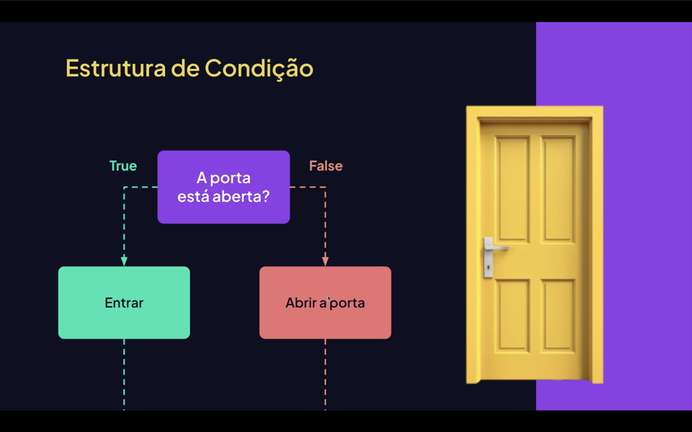

<h1 align="center"> Condicional Simples no JavaScript </h1>

<p align="center">

</p>

<p align="center">
  
  
  
</p>


## 📌 O que é Condicional Simples?

Condicional simples é quando utilizamos apenas o `if` para executar um bloco de código **somente se a condição for verdadeira**.

Se a condição for falsa, nada acontece.

É a forma mais básica de controle de decisão no JavaScript.


## 🧠 Estrutura Básica

```js
if (condição) {
    // código executado se for true
}
```

📌 A condição sempre precisa retornar true ou false.
📌 Não existe else na condicional simples.

<br>

# 🔢 Exemplo 1 — Verificando Idade

```js
let idade = 18;

if (idade >= 18) {
    console.log("Maior de idade ✅");
}
```

✅ Executa se a idade for 18 ou maior
❌ Não executa nada se for menor

<br>

# 💰 Exemplo 2 — Verificando Saldo

```js
let saldo = 100;

if (saldo > 0) {
    console.log("Saldo disponível 💵");
}
```

✅ Executa se o saldo for maior que zero
❌ Não executa se for zero ou negativo

<br>

# 🔎 Exemplo 3 — Usando Operador Lógico

```js
let idade = 20;
let temCarteira = true;

if (idade >= 18 && temCarteira) {
    console.log("Pode dirigir 🚗");
}
``` 
✅ A condição só será verdadeira se as DUAS forem verdadeiras

<br>

# 🎯 Resumo
if executa código apenas se a condição for verdadeira;
Não possui alternativa (else); e
É a base para estruturas condicionais mais complexas.