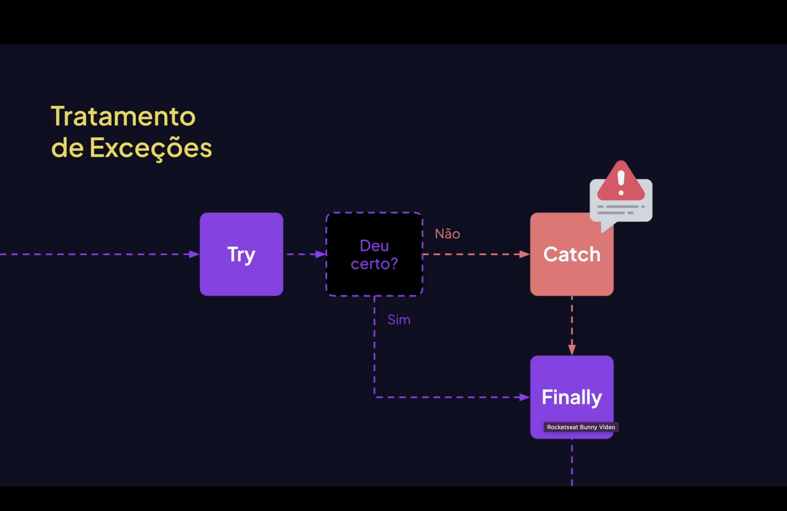

<h1 align="center"> Tratamento de <mark style="background-color: red">Erros</mark> no JavaScript </h1>

<p align="center">

</p>

<p align="center">
  
  
  
</p>


## 📌 O que é Tratamento de Erros?

Tratamento de erros é a forma de **evitar que o programa quebre** quando algo inesperado acontece.

No JavaScript usamos principalmente:

- `try`;
- `catch`;
- `finally`;
- `throw`.

Isso permite capturar erros e controlar o que acontece depois.


## 🏰 Estrutura Básica:

```js
try {
    // código que pode gerar erro
}
catch (erro) {
    // executa se houver erro
}
finally {
    // executa sempre
}
```

📌 O try tenta executar
📌 O catch captura o erro
📌 O finally executa independente de erro

<br>

⚠️ Exemplo 1 — Erro Simples:
```js
try {
    console.log(nome)
}
catch (erro) {
    console.log("Ocorreu um erro ❌")
}
```
✅ Evita que o programa pare
❌ Sem try/catch o código quebraria

<br>

➗ Exemplo 2 — Forçando um Erro
```js
try {
    let numero = 10
    let resultado = numero / 0

    if (!isFinite(resultado)) {
        throw new Error("Divisão inválida")
    }

    console.log(resultado)
}
catch (erro) {
    console.log(`Erro capturado: ${erro.message}`)
}
```

✅ throw cria um erro manualmente; <br>
✅ catch captura e trata.

<br>

🧹 Exemplo 3 — Usando Finally
```js
try {
    console.log("Executando...")
}
catch (erro) {
    console.log("Erro!")
}
finally {
    console.log("Finalizado ✅")
}
``` 
✅ O finally <mark>sempre</mark> executa

<br>

# 🎯 Resumo
try executa o código que pode falhar;
catch captura e trata o erro;
finally executa sempre; e
throw permite criar erros personalizados.