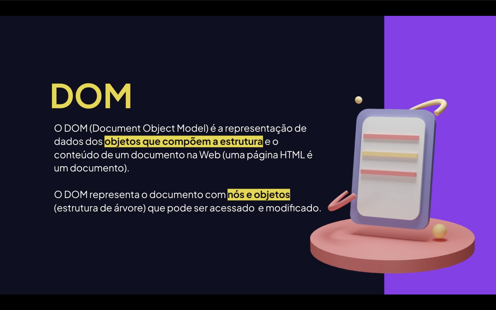
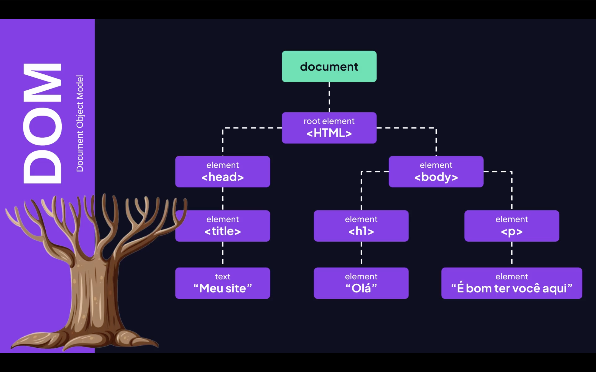

<h1 align="center"> DOM (Document Object Model) no JavaScript  <br>
</h1>


# 📌 O que é o DOM?

- o **DOM (Document Object Model)** é a representação da estrutura do HTML em forma de **objetos JavaScript**.

Quando o navegador carrega uma página HTML, ele:

1. Lê o arquivo HTML 📄; 
2. Constrói uma estrutura em árvore 🌳; e 
3. Transforma cada elemento em um OBJETO manipulável.

Isso significa que o JavaScript pode:

- Alterar textos;
- Modificar estilos;
- Criar elementos;
- Remover elementos;
- Reagir a eventos;
- Navegar pela estrutura da página.

<h2 align="center">🌳 Estrutura em Árvore <br><br>
</h2>

O DOM funciona como uma <mark>**árvore hierárquica**<mark>.

## Exemplo de <mark style="background-color: orange"> HTML </mark>:

```html
<!DOCTYPE html>
<html lang="pt-BR">
<head>
  <meta charset="UTF-8">
  <meta name="viewport" content="width=device-width, initial-scale=1.0">
  <title>Exemplo DOM</title>
</head>
<body>

  <header>
    <h1 id="titulo">Título</h1>
  </header>

  <main>
    <section>
      <p class="texto">Parágrafo</p>
      <button id="botao">Clique aqui</button>
    </section>
  </main>

  <footer>
    <small>© 2026 - Exemplo DOM</small>
  </footer>

  <script src="script.js"></script>
</body>
</html>
```

Representação no <em>DOM</em>:
<pre>
document/
 └── html
      └── body
           ├── h1
           └── p
</pre>

# 🌳 Cada item da árvore é chamado de:
- Node (nó);
- Element (elemento);
- Text (texto).

<br>

- 📍 O Objeto Principal: document
- O objeto mais importante do DOM é:
- document
- Ele representa toda a página HTML.

<br>

# 🌳 DOM (Document Object Model) no JavaScript 

## 📌 Exemplo Inicial:
```js
console.log(document);
```

## 🔎 Selecionando Elementos:
- 1️⃣ Por ID

```js
let titulo = document.getElementById("titulo")
```

- 2️⃣ Por Classe

```js
let itens = document.getElementsByClassName("item");
```

- 3️⃣ Por Tag

```js
let paragrafos = document.getElementsByTagName("p");
```

- 4️⃣ Forma Moderna (Mais Usada) ✅

```js
let caixa = document.querySelector(".caixa");
let todasCaixas = document.querySelectorAll(".caixa");
```

# Diferença 🤔:
- querySelector → retorna o <mark style="background-color: orange">primeiro</mark> elemento encontrado;
- querySelectorAll → retorna <mark style="background-color: pink">todos</mark> os elementos.

<br>

# ✏️ Alterando Conteúdo

- 🔹 innerText:

```js
titulo.innerText = "Novo Título";
```

- 🔹 textContent:

```js
titulo.textContent = "Texto atualizado";
```

- 🎨 Alterando Estilos:

```js
titulo.style.color = "blue";
titulo.style.backgroundColor = "yellow";
titulo.style.fontSize = "30px";
```
background-color → backgroundColor;
font-size → fontSize.

- 🆕 Criando Elementos:
```js
let novoParagrafo = document.createElement("p");
novoParagrafo.innerText = "Criado pelo JavaScript 😎";
document.body.appendChild(novoParagrafo);
```

- ❌ Removendo Elementos:

```js
novoParagrafo.remove();
elementoPai.removeChild(elementoFilho);
```

- 🖱️ Trabalhando com Eventos

```js

titulo.addEventListener("click", function () {
  alert("Você clicou no título 🚀");
});
```

- 🌎 Navegando na Árvore do DOM:

```js
elemento.parentNode;
elemento.children;
elemento.firstElementChild;
elemento.lastElementChild;
console.log(document.body.children);
```
