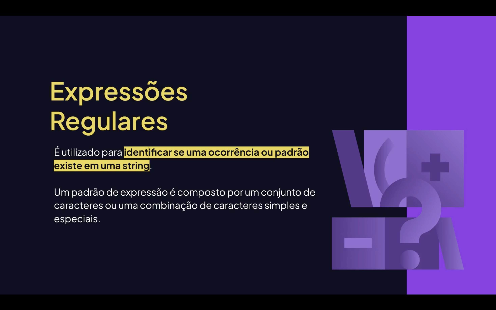

<h1 align="center">
  🔎 Regexr no JavaScript <br>
  
</h1>

<p align="center">
  
  
  
</p>


<h2 align="center">📌 O que é o Regexr? <br><br>
</h2>


O **Regexr** é uma ferramenta online para testar e aprender **Expressões Regulares (RegEx)** de forma interativa.  

Ele permite:

- Testar padrões em tempo real;  
- Ver explicações detalhadas de cada parte da expressão;  
- Visualizar grupos de captura;  
- Simular flags como `g`, `i`, `m`;  
- Aprender com exemplos prontos.  

🔗 Site oficial: https://regexr.com

---

## 🧠 O que é RegEx?

**RegEx (Regular Expression)** é um padrão usado para buscar, validar e manipular textos.

No **JavaScript**, usamos RegEx para:

- Validar emails;  
- Validar CPF, telefone, senha;  
- Extrair dados de textos;  
- Substituir partes de uma string;  
- Fazer buscas avançadas.  

---

## 🧩 Sintaxe básica no JavaScript

Existem duas formas principais de criar uma expressão regular:

### 1️⃣ Forma literal

```js
const regex = /abc/;