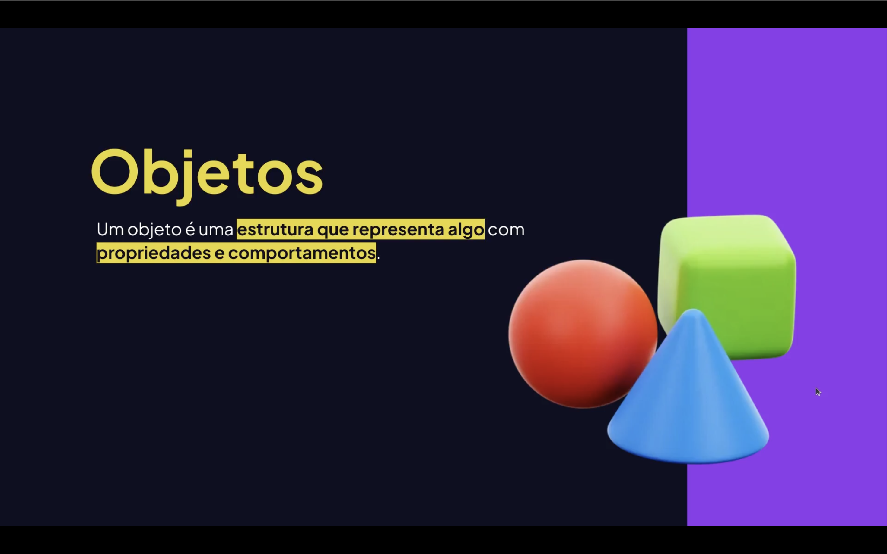
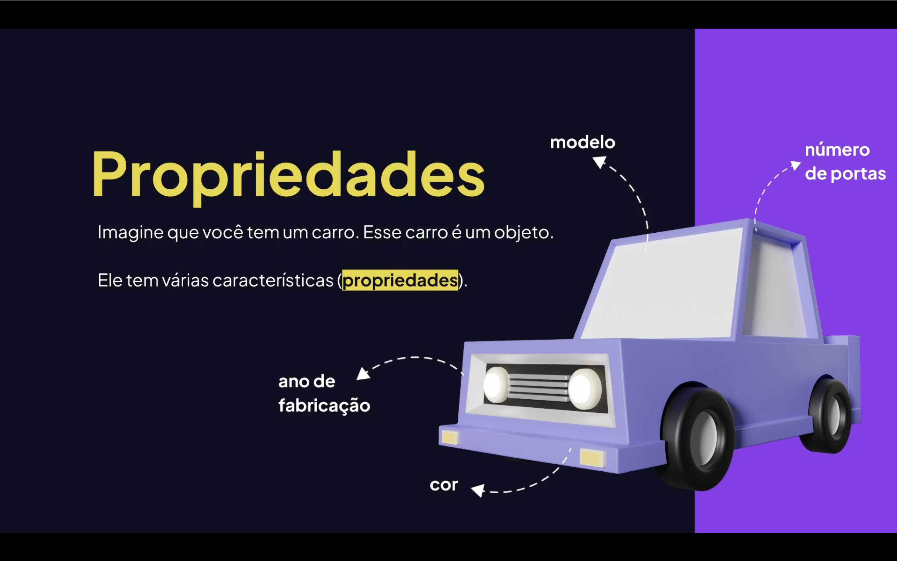
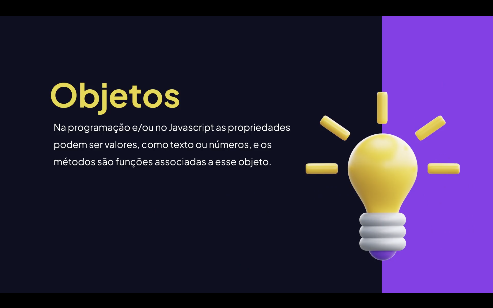

<h1 align="center">📦 Objetos em JavaScript<br>
</h1>


<h2 align="center">📚 Sobre: <br>
</h2>


Os <mark>**objetos em JavaScript**</mark> são estruturas fundamentais usadas para armazenar **dados em pares de chave e valor**.

Eles permitem representar **entidades do mundo real**, como:

- 👤 Usuários  
- 🚗 Carros  
- 📦 Produtos  
- 📚 Livros  
- 🏦 Contas bancárias  

Cada objeto pode conter:

- <em>**Propriedades**</em> → dados armazenados  
- **Métodos** → funções dentro do objeto  

---

<h2 align="center">🧠 Estrutura Básica e Propriedades: <br>
</h2>

```javascript
const pessoa = {
  nome: "Lucas",
  idade: 25,
  profissao: "Desenvolvedor"
}

console.log(pessoa.nome) 
console.log(pessoa.idade) 
// .nome e .pessoa =  Parâmetros da classe pessoa 👤
```

📌 Saída:

```
Lucas
25
```

<h2 align="center"🖼> Representação de um Objeto 📨 <br>
</h2>


## 🔑 Acessando Propriedades

Existem <mark>**duas formas de acessar propriedades**.</mark>

### 1️⃣ Notação de ponto

```javascript
console.log(pessoa.nome)
```

### 2️⃣ Notação de colchetes

```javascript
console.log(pessoa["idade"])
```

📌 A notação de colchetes é útil quando:

- a propriedade vem de uma variável  
- o nome contém espaços  

## ⚙️ Métodos em Objetos

Objetos também podem conter **funções**, chamadas de **métodos**.

```javascript
const usuario = {
  nome: "Lucas",

  saudacao: function () {
    return "Olá, " + this.nome
  }
}

console.log(usuario.saudacao())
```

📌 Saída:

```
Olá, Lucas
```

`this` referencia o **próprio objeto**.

## 🖼 Como Métodos Funcionam

## ➕ Adicionando Propriedades

Podemos adicionar propriedades **depois que o objeto já foi criado**.

```javascript
const carro = {
  marca: "Toyota"
}

carro.modelo = "Corolla"
carro.ano = 2024

console.log(carro)
```

📌 Resultado

```
{ marca: 'Toyota', modelo: 'Corolla', ano: 2024 }
```

## 🖼 Estrutura de Dados

## ❌ Removendo Propriedades

Podemos remover propriedades usando `delete`.

```javascript
const produto = {
  nome: "Notebook",
  preco: 3000,
  estoque: true
}

delete produto.estoque

console.log(produto)
```

📌 Resultado

```
{ nome: 'Notebook', preco: 3000 }
```


## 🔁 Percorrendo Objetos

Podemos percorrer um objeto usando **for...in**.

```javascript
const aluno = {
  nome: "Lucas",
  idade: 21,
  curso: "Programação"
}

for (let chave in aluno) {
  console.log(chave, aluno[chave])
}
```

📌 Saída

```
nome Lucas
idade 21
curso Programação
```

# 🖼 Iteração em Objetos

## 🧩 Objetos Dentro de Objetos

Objetos podem conter **outros objetos**.

```javascript
const usuario = {
  nome: "Lucas",

  endereco: {
    cidade: "Recife",
    estado: "PE"
  }
}

console.log(usuario.endereco.cidade)
```

📌 Saída

```
Recife
```


## 📊 Quando Usar Objetos

Use objetos quando precisar representar:

- 👤 usuários  
- 📦 produtos  
- 🚗 veículos  
- 🧾 pedidos  
- 🏢 empresas  

Eles são ideais para **estruturar dados complexos**.


## 🚀 Conclusão

Objetos são um dos **pilares do JavaScript** e são essenciais para:

- estruturar dados;  
- organizar aplicações;  
- criar APIs;  
- trabalhar com JSON;  
- desenvolver aplicações modernas.

Dominar objetos é **fundamental para qualquer desenvolvedor JavaScript**.


## 📖 Recursos para Estudo

📚 Documentação oficial

- https://developer.mozilla.org/pt-BR/docs/Web/JavaScript/Guide/Working_with_Objects
- https://javascript.info/object
- https://www.w3schools.com/js/js_objects.asp
