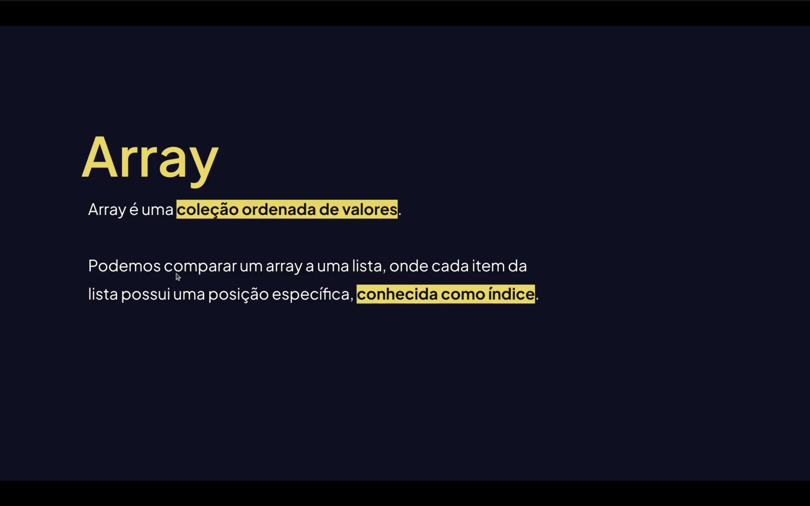
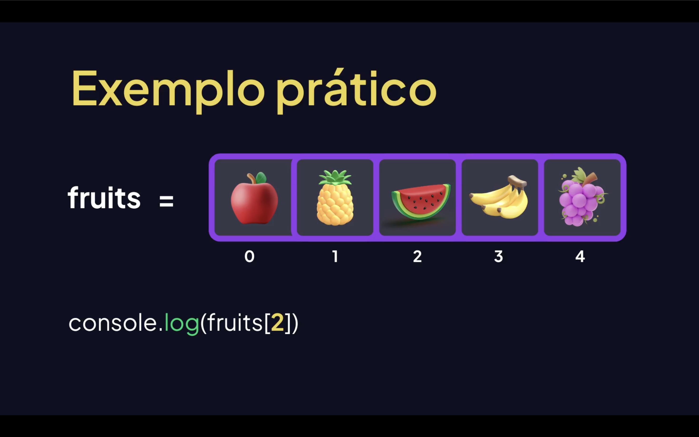

<h1 align="center">Arrays em JavaScript <br>
</h1>

<p align="center">Arrays são estruturas de dados fundamentais em JavaScript que permitem armazenar múltiplos valores em uma única variável, de forma ordenada e indexada. <br>
</p>

---

<h2 align="center">Criando Arrays <br>
</h2>

```js
// Literal (recomendado)
const frutas = ["maçã", "banana", "laranja"];

// Construtor
const numeros = new Array(1, 2, 3);

// Array vazio
const vazio = [];
```

---

## Acessando Elementos

Os índices começam em `0`.

```js
const frutas = ["maçã", "banana", "laranja"];

console.log(frutas[0]); // "maçã"
console.log(frutas[2]); // "laranja"
console.log(frutas.at(-1)); // "laranja" (último elemento)
```

---

## Propriedades Básicas

```js
const frutas = ["maçã", "banana", "laranja"];

console.log(frutas.length); // 3
```

---

## Métodos de Inserção e Remoção

| Método | Descrição |
|---|---|
| `push(item)` | Adiciona ao **final** |
| `pop()` | Remove do **final** |
| `unshift(item)` | Adiciona ao **início** |
| `shift()` | Remove do **início** |
| `splice(i, n, ...items)` | Remove/substitui elementos a partir do índice `i` |

```js
const arr = [1, 2, 3];

arr.push(4);        // [1, 2, 3, 4]
arr.pop();          // [1, 2, 3]
arr.unshift(0);     // [0, 1, 2, 3]
arr.shift();        // [1, 2, 3]
arr.splice(1, 1);   // [1, 3] — remove 1 elemento no índice 1
```

---

## Iteração

```js
const nums = [10, 20, 30];

// for clássico
for (let i = 0; i < nums.length; i++) {
  console.log(nums[i]);
}

// for...of (mais limpo)
for (const n of nums) {
  console.log(n);
}

// forEach
nums.forEach((n, i) => console.log(`${i}: ${n}`));
```

---

## Métodos Funcionais (os mais usados)

### `map` — transforma cada elemento

```js
const dobros = [1, 2, 3].map(n => n * 2);
// [2, 4, 6]
```

### `filter` — filtra por condição

```js
const pares = [1, 2, 3, 4].filter(n => n % 2 === 0);
// [2, 4]
```

### `reduce` — acumula em um único valor

```js
const soma = [1, 2, 3, 4].reduce((acc, n) => acc + n, 0);
// 10
```

### `find` — retorna o primeiro elemento que satisfaz a condição

```js
const primeiro = [5, 12, 8].find(n => n > 10);
// 12
```

### `findIndex` — retorna o índice do primeiro elemento encontrado

```js
const idx = [5, 12, 8].findIndex(n => n > 10);
// 1
```

### `some` / `every` — verificações booleanas

```js
[1, 2, 3].some(n => n > 2);   // true
[1, 2, 3].every(n => n > 0);  // true
```

---

## Ordenação e Reversão

```js
const letras = ["c", "a", "b"];
letras.sort();     // ["a", "b", "c"]
letras.reverse();  // ["c", "b", "a"]

// Ordenação numérica correta
[10, 1, 5].sort((a, b) => a - b); // [1, 5, 10]
```

---

## Outros Métodos Úteis

```js
// Concatenar arrays
[1, 2].concat([3, 4]); // [1, 2, 3, 4]

// Achatar arrays aninhados
[1, [2, [3]]].flat(Infinity); // [1, 2, 3]

// Fatiar (não modifica o original)
[1, 2, 3, 4].slice(1, 3); // [2, 3]

// Verificar se é array
Array.isArray([1, 2]); // true

// Checar se inclui um valor
[1, 2, 3].includes(2); // true

// Índice de um valor
[1, 2, 3].indexOf(2); // 1

// Juntar em string
["a", "b", "c"].join("-"); // "a-b-c"

// Criar array a partir de iterável
Array.from("abc");      // ["a", "b", "c"]
Array.from({length: 3}, (_, i) => i); // [0, 1, 2]
```

---

## Spread e Desestruturação

```js
// Spread: clonar ou mesclar arrays
const copia = [...[1, 2, 3]];
const merged = [...[1, 2], ...[3, 4]]; // [1, 2, 3, 4]

// Desestruturação
const [primeiro, segundo, ...resto] = [10, 20, 30, 40];
// primeiro = 10, segundo = 20, resto = [30, 40]
```

---

## Encadeamento (Method Chaining)

```js
const resultado = [1, 2, 3, 4, 5]
  .filter(n => n % 2 !== 0)  // [1, 3, 5]
  .map(n => n ** 2)           // [1, 9, 25]
  .reduce((acc, n) => acc + n, 0); // 35
```

---

## <mark>Dicas Importantes!</mark>

- `sort()` modifica o array original — use `[...arr].sort()` para não alterar o original.
- `map`, `filter` e `slice` **não** modificam o array original.
- `push`, `pop`, `splice`, `sort` e `reverse` **modificam** o array original.
- Prefira métodos funcionais (`map`, `filter`, `reduce`) para código mais legível e previsível.