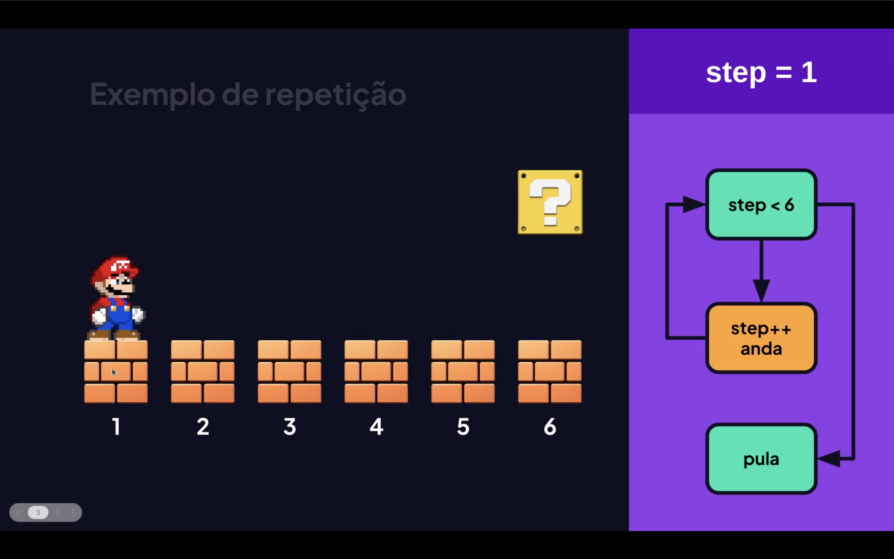
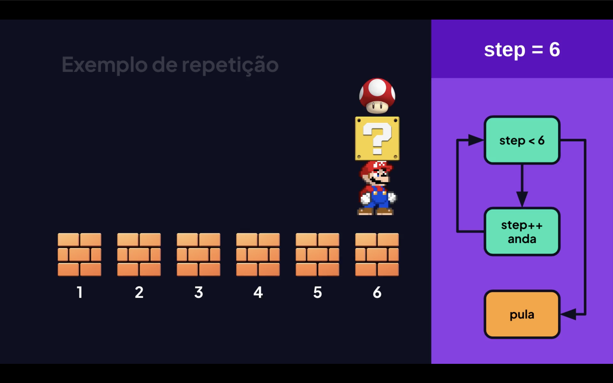

<h1 align="center">🔁 Loops em JavaScript <br>
</h1>


> <mark>Loop</mark> são estruturas de repetição que permitem executar um bloco de código **várias vezes**, enquanto uma condição for verdadeira. São fundamentais em qualquer linguagem de programação! 🚀

<h2 align="center">Exemplos: 🖊️<br>
 <br>
</h2>

## 📚 Sumário

- [🔄 for](#-for)
- [🔁 while](#-while)
- [🔃 do...while](#-dowhile)
- [📦 for...of](#-forof)
- [🗝️ for...in](#️-forin)
- [⚠️ Cuidados](#️-cuidados)
- [✅ Boas Práticas](#-boas-práticas)

---

## 🔄 `for`

O loop mais clássico e utilizado. Ideal quando você **sabe quantas vezes** quer repetir algo.

### 🧩 Estrutura

```js
for (inicialização; condição; incremento) {
  // código a executar
}
```

### 💡 Exemplo

```js
for (let i = 0; i < 5; i++) {
  console.log(`Iteração número ${i}`);
}

// Saída:
// Iteração número 0
// Iteração número 1
// Iteração número 2
// Iteração número 3
// Iteração número 4
```

> 📝 **Detalhe importante:** `i++` é equivalente a `i = i + 1`. Você também pode usar `i += 2` para pular de dois em dois, ou `i--` para decrementar!

---

## 🔁 `while`

Executa o bloco **enquanto** a condição for verdadeira. Use quando **não sabe** exatamente quantas repetições serão necessárias.

### 🧩 Estrutura

```js
while (condição) {
  // código a executar
}
```

### 💡 Exemplo

```js
let contador = 0;

while (contador < 3) {
  console.log(`Contando: ${contador}`);
  contador++;
}

// Saída:
// Contando: 0
// Contando: 1
// Contando: 2
```

> <mark>⚠️ **Atenção:**</mark> Se a condição nunca se tornar `false`, você terá um **loop infinito** que pode travar o programa!

---

## 🔃 `do...while`

Parecido com o `while`, mas com uma diferença crucial: o bloco de código é executado **pelo menos uma vez**, mesmo que a condição seja falsa desde o início.

### 🧩 Estrutura

```js
do {
  // código a executar
} while (condição);
```

### 💡 Exemplo

```js
let tentativas = 0;

do {
  console.log(`Tentativa ${tentativas + 1}`);
  tentativas++;
} while (tentativas < 3);

// Saída:
// Tentativa 1
// Tentativa 2
// Tentativa 3
```

### 🆚 Diferença entre `while` e `do...while`

```js
// while — NÃO executa se a condição já for falsa
let x = 10;
while (x < 5) {
  console.log("Isso nunca aparece");
}

// do...while — executa UMA vez mesmo com condição falsa
do {
  console.log("Isso aparece pelo menos uma vez! 😮");
} while (x < 5);
```

---

## 📦 `for...of`

Perfeito para **iterar sobre arrays** (listas) e outros objetos iteráveis como strings. Muito mais limpo e legível! ✨

### 🧩 Estrutura

```js
for (const item of iterável) {
  // código a executar
}
```

### 💡 Exemplo com Array

```js
const frutas = ["🍎 Maçã", "🍌 Banana", "🍇 Uva", "🍓 Morango"];

for (const fruta of frutas) {
  console.log(`Fruta: ${fruta}`);
}

// Saída:
// Fruta: 🍎 Maçã
// Fruta: 🍌 Banana
// Fruta: 🍇 Uva
// Fruta: 🍓 Morango
```

### 💡 Exemplo com String

```js
const palavra = "JavaScript";

for (const letra of palavra) {
  process.stdout.write(letra + " ");
}

// Saída: J a v a S c r i p t
```

---

## 🗝️ `for...in`

Usado para iterar sobre as **chaves (propriedades)** de um objeto. Ideal para explorar objetos literais.

### 🧩 Estrutura

```js
for (const chave in objeto) {
  // código a executar
}
```

### 💡 Exemplo

```js
const pessoa = {
  nome: "Ana",
  idade: 25,
  cidade: "São Paulo",
};

for (const chave in pessoa) {
  console.log(`${chave}: ${pessoa[chave]}`);
}

// Saída:
// nome: Ana
// idade: 25
// cidade: São Paulo
```

> 🔎 **Dica:** Use `for...of` para **arrays** e `for...in` para **objetos**. Misturar os dois pode gerar resultados inesperados!

---

## 🛑 `break` e `continue`

Dois comandos especiais que controlam o fluxo dos loops:

| Comando | O que faz |
|---|---|
| `break` | 🛑 **Para** o loop imediatamente |
| `continue` | ⏭️ **Pula** a iteração atual e vai para a próxima |

### 💡 Exemplo com `break`

```js
for (let i = 0; i < 10; i++) {
  if (i === 5) break; // Para quando chegar em 5
  console.log(i);
}
// Saída: 0 1 2 3 4
```

### 💡 Exemplo com `continue`

```js
for (let i = 0; i < 6; i++) {
  if (i === 3) continue; // Pula o número 3
  console.log(i);
}
// Saída: 0 1 2 4 5
```

---

## ⚠️ Cuidados


```js
// ❌ Loop infinito — NUNCA faça isso!
while (true) {
  console.log("Isso nunca para...");
  // Esqueceu o incremento ou condição de saída!
}

// ❌ Usar var dentro de loops (pode causar bugs com closures)
for (var i = 0; i < 3; i++) {
  setTimeout(() => console.log(i), 100); // Imprime 3, 3, 3 😱
}

// ✅ Use let no lugar de var dentro de loops
for (let i = 0; i < 3; i++) {
  setTimeout(() => console.log(i), 100); // Imprime 0, 1, 2 ✅
}
```

---

## ✅ Boas Práticas

- 🔹 Prefira `for...of` ao `for` tradicional ao iterar arrays
- 🔹 Use `const` ou `let` ao invés de `var` dentro de loops
- 🔹 Sempre garanta uma **condição de saída** para evitar loops infinitos
- 🔹 Mantenha o corpo do loop **simples e direto** — extraia lógica complexa para funções
- 🔹 Para arrays, considere também métodos como `.forEach()`, `.map()`, `.filter()` — são mais expressivos! 😎

---

## 🗺️ Resumo Visual

| Loop | Quando usar |
|---|---|
| `for` | Sabe o número de repetições |
| `while` | Condição verificada antes de executar |
| `do...while` | Executa ao menos uma vez |
| `for...of` | Iterar arrays e iteráveis |
| `for...in` | Iterar chaves de objetos |

---