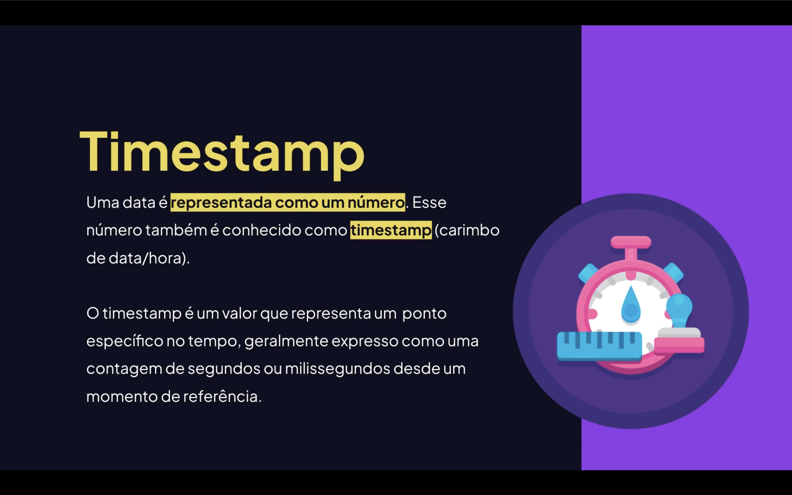
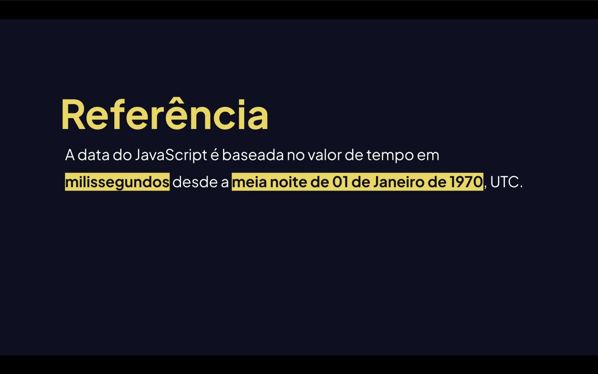

<h1 align="center">⏰ Fusos Horários e Timestamp em JavaScript <br>
</h1>

<p align="center">


</p>


<h2 align="center">📖 Introdução</h2>

Trabalhar com **datas e horários** em JavaScript pode parecer simples no início, mas envolve conceitos importantes como:

- <mark>Fusos horários;</mark>
- <mark>Timestamp;</mark>
- <mark>Conversões de data;</mark>
- <mark>Formatação de datas;</mark>
- <mark>Horário UTC e horário local.</mark>

O JavaScript possui a **classe `Date`**, responsável por manipular datas e horários.

---

<h2 align="center">🕒 O que é Timestamp? <br>
</h2>

Um **timestamp** é um número que representa um momento específico no tempo.

Normalmente ele representa:

**Quantidade de milissegundos desde 1 de Janeiro de 1970 (UTC)**

<p align="center">Esse padrão é chamado de <strong>Unix Epoch</strong>.

</p>

<br>

---

## 📌 Obtendo um Timestamp

```js
const agora = Date.now();

console.log(agora);
Exemplo de saída:
1719945935123
Esse número representa milissegundos desde 1970.
📌 Criando uma data a partir de um Timestamp
const data = new Date(1719945935123);

console.log(data);
```

## Resultado:
```js
Tue Jul 02 2024 14:45:35 GMT-0300
```

<h2 align="center">🌍 O que são Fusos Horários? <br>
</h2>

## 🌍 Fusos Horários

Fusos horários representam as **diferenças de horário entre regiões do mundo**.

A Terra é dividida em **24 fusos horários**, cada um representando aproximadamente **1 hora de diferença**.

### Exemplo

| Cidade | Fuso |
|------|------|
| Londres | UTC +0 |
| Brasília | UTC -3 |
| Nova York | UTC -5 |
| Tóquio | UTC +9 |

---

## 🌐 UTC (Tempo Universal)

UTC significa:

**Coordinated Universal Time**

É o padrão mundial usado para sincronizar horários.

O **JavaScript armazena datas internamente em UTC**.

---

## 📌 Obtendo data em UTC

```js
const data = new Date();

console.log(data.toUTCString());
Exemplo de saída
Tue, 02 Jul 2024 17:45:35 GMT
🖥 Horário Local
Para obter o horário local do sistema:
const data = new Date();

console.log(data.toString());
```

## Exemplo de saída
```js
Tue Jul 02 2024 14:45:35 GMT-0300 (Brasilia Standard Time)
```

# 📅 Manipulação de Datas em JavaScript

## 📅 Criando Datas

Você pode criar **datas** em JavaScript de várias formas usando a classe `Date`.

### 1️⃣ Data atual

```js
const data = new Date();

# 📅 Manipulação de Datas em JavaScript

## 📅 Criando Datas
Você pode criar datas de várias formas.

### 1️⃣ Data atual
```js
const data = new Date();
```

### 2️⃣ Data específica
```js
const data = new Date("2026-07-02T14:30:59");
```

### 3️⃣ Usando números
```js
const data = new Date(2026, 6, 2, 14, 30, 59);
```

⚠️ Atenção: o mês começa do **0**.

| Número | Mês |
|------|------|
| 0 | Janeiro |
| 1 | Fevereiro |
| 6 | Julho |

---

# 🧮 Métodos importantes da classe Date

| Método | Função |
|------|------|
| getFullYear() | Ano |
| getMonth() | Mês |
| getDate() | Dia |
| getHours() | Hora |
| getMinutes() | Minutos |
| getSeconds() | Segundos |

---

## 📌 Exemplo

```js
const data = new Date();

console.log(data.getFullYear());
console.log(data.getMonth());
console.log(data.getDate());
console.log(data.getHours());
```

---

# 🛠 Modificando Datas

```js
const data = new Date();

data.setFullYear(2030);
data.setMonth(5);
data.setDate(15);

console.log(data);
```

---

# 🎯 Formatando Datas

```js
const data = new Date();

const dia = data.getDate().toString().padStart(2,"0");
const mes = (data.getMonth()+1).toString().padStart(2,"0");
const ano = data.getFullYear();

console.log(`${dia}/${mes}/${ano}`);
```

Resultado

```
02/07/2024
```

---

# 🌎 Usando toLocaleString()

```js
const data = new Date();

console.log(data.toLocaleString("pt-BR"));
```

Resultado

```
02/07/2024 14:45:35
```

---

## 📌 Exemplo com opções

```js
const data = new Date();

const formato = {
    day: "2-digit",
    month: "2-digit",
    year: "numeric",
    hour: "2-digit",
    minute: "2-digit"
};

console.log(data.toLocaleString("pt-BR", formato));
```

---

# 🧠 Diferença entre Timestamp e Date

| Timestamp | Date |
|------|------|
| Número | Objeto |
| Representa milissegundos | Representa data legível |
| Mais usado em bancos de dados | Mais usado em exibição |

---

# 🚀 Exemplo completo

```js
const agora = new Date();
const timestamp = Date.now();

console.log("Data atual:", agora);
console.log("Timestamp:", timestamp);
console.log("UTC:", agora.toUTCString());
console.log("Local:", agora.toLocaleString("pt-BR"));
```