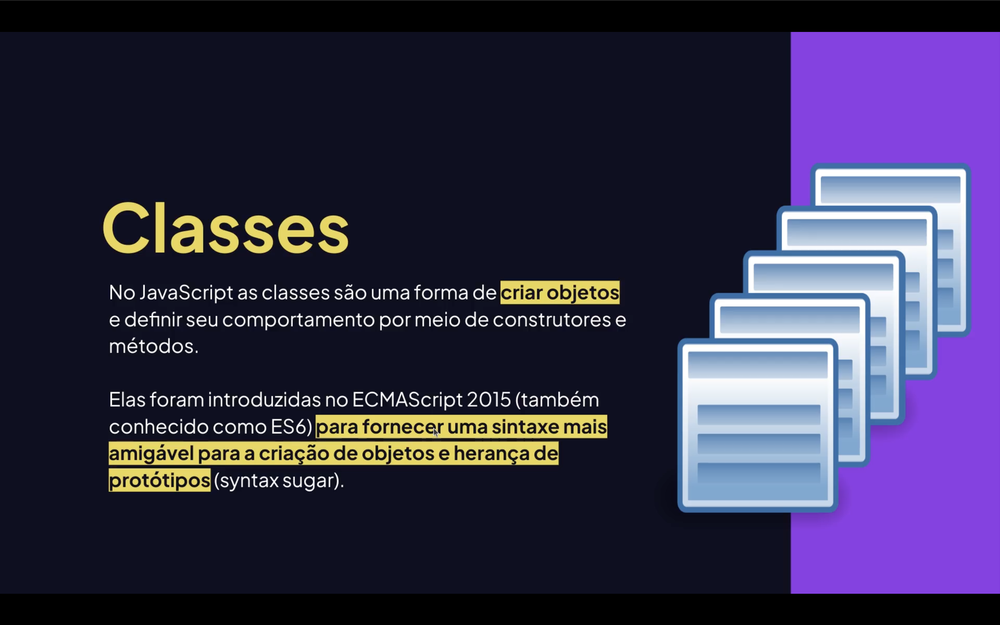
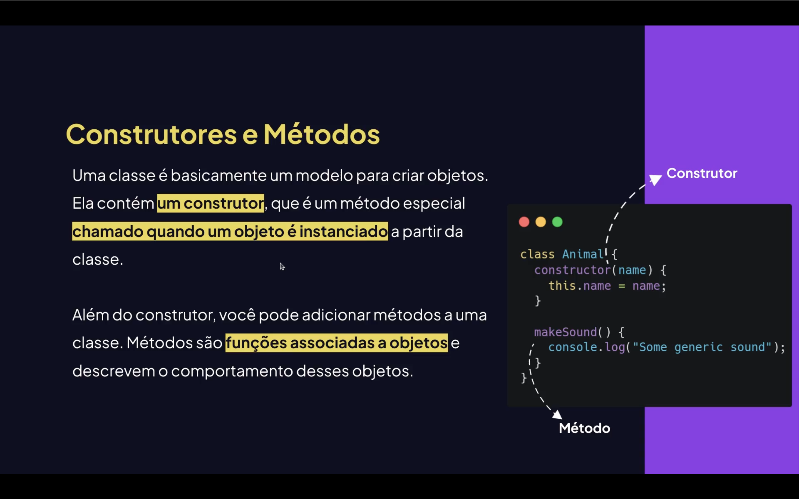
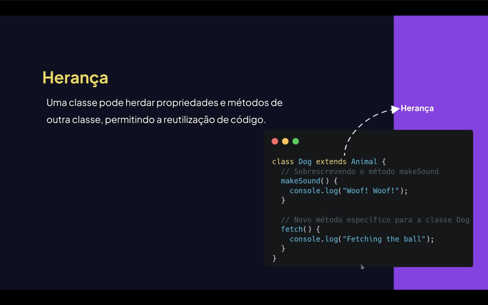

<h1 align="center">🏛 Classes em JavaScript <br>
</h1>

<p align="center">


</p>

---

<h2 align="center">📖 Introdução</h2>

As **classes** em JavaScript são uma forma moderna de trabalhar com **Programação Orientada a Objetos (POO)**.

Elas foram introduzidas no **ES6 (ECMAScript 2015)** e permitem criar **modelos de objetos**, facilitando a organização do código.

Com classes podemos trabalhar com:

- <mark>Objetos;</mark>
- <mark>Propriedades;</mark>
- <mark>Métodos;</mark>
- <mark>Herança;</mark>
- <mark>Encapsulamento.</mark>

---

<h2 align="center">🏗 O que é uma Classe? <br>
</h2>

Uma **classe** funciona como um **molde (modelo)** para criar objetos.

Ela define:

- propriedades🔷;
- métodos🔷;
- comportamentos🔷.

### <mark style="background-color: pink">Exemplo conceitual:</mark>

Classe → <strong>**Produto**</strong>;

Objeto → <strong>**Notebook**</strong>.


# 📦 Criando uma Classe

```js
class Produto {

    constructor(nome, preco){
        this.nome = nome;
        this.preco = preco;
    }

}
```

<p align="left">O método constructor() é executado quando <strong>criamos um novo objeto da classe.</strong></p>

# 🧱 Criando Objetos a partir da Classe
```js
class Produto {

    constructor(nome, preco){
        this.nome = nome;
        this.preco = preco;
    }

}

const produto1 = new Produto("Notebook", 3500);
const produto2 = new Produto("Mouse", 80);

console.log(produto1);
console.log(produto2);
```

Resultado:
```js
Produto { nome: 'Notebook', preco: 3500 }
Produto { nome: 'Mouse', preco: 80 }
```

<h2 align="center">⚙️ Métodos em Classes <br> </h2>

## Classes podem possuir métodos, que são funções internas.
```js
class Produto {

    constructor(nome, preco){
        this.nome = nome;
        this.preco = preco;
    }

    mostrarProduto(){
        console.log(`Produto: ${this.nome} - Preço: ${this.preco}`);
    }

}
```

## 📌 Utilizando o método
```js
const produto = new Produto("Teclado", 150);

produto.mostrarProduto();
```

Resultado:
```js
Produto: Teclado - Preço: 150
```

## 🔒 Encapsulamento

<strong>Encapsulamento significa proteger dados internos da classe.
No JavaScript moderno usamos # para propriedades privadas.</strong>

```js
class Conta {

    #saldo = 0;

    depositar(valor){
        this.#saldo += valor;
    }

    verSaldo(){
        return this.#saldo;
    }

}
```

## 📌 Exemplo de uso:
```js
const conta = new Conta();

conta.depositar(500);

console.log(conta.verSaldo());
```
## Resultado:
```js
500
```

<h2 align="center">🧬 Herança <br> </h2>

<mark style="background-color: yellow; color: black">Herança</mark> <strong>permite que uma classe herde propriedades e métodos de outra.</strong>

Utilizamos a palavra-chave: '<strong>extends</strong>'
```js
class Animal {

    constructor(nome){
        this.nome = nome;
    }

    falar(){
        console.log(`${this.nome} fez um som`);
    }

}
Classe filha
class Cachorro extends Animal {

    latir(){
        console.log(`${this.nome} está latindo`);
    }

}
```

## 📌 Exemplo
```js
const dog = new Cachorro("Rex");

dog.falar();
dog.latir();
```

Resultado:
```js
Rex fez um som
Rex está latindo
```

## 🧠 Método static
Métodos static pertencem à classe, não ao objeto.
```js
class Matematica {

    static somar(a, b){
        return a + b;
    }

}
```

## 📌 Utilização
```js
console.log(Matematica.somar(10,5));
```

Resultado
```js
15
```

# 📊 Comparação: Função Construtora vs Classe
Função Construtora	Classe
Forma antiga	Forma moderna
Usa function	Usa class
Menos organizada	Mais legível
Pré ES6	ES6+
## 🚀 Exemplo Completo: 

```js
class Usuario {

    constructor(nome, idade){
        this.nome = nome;
        this.idade = idade;
    }

    apresentar(){
        console.log(`Olá, meu nome é ${this.nome} e tenho ${this.idade} anos`);
    }

}

const user = new Usuario("Lucas", 20);

user.apresentar();
```

## Resultado

```js
Olá, meu nome é Lucas e tenho 20 anos
```