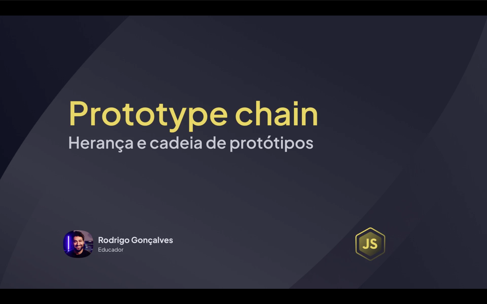
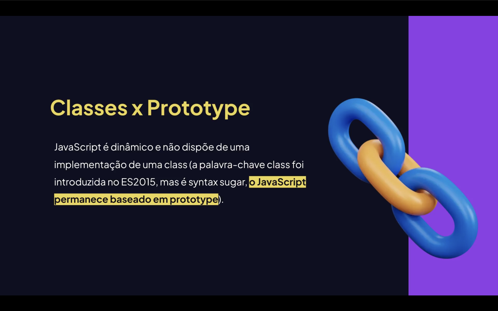
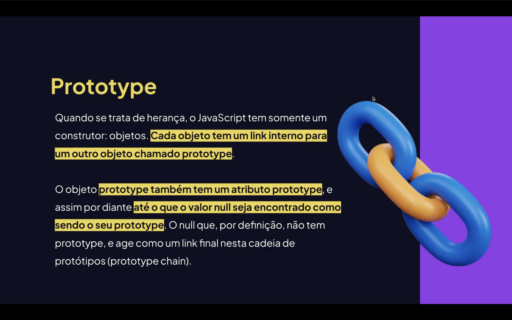
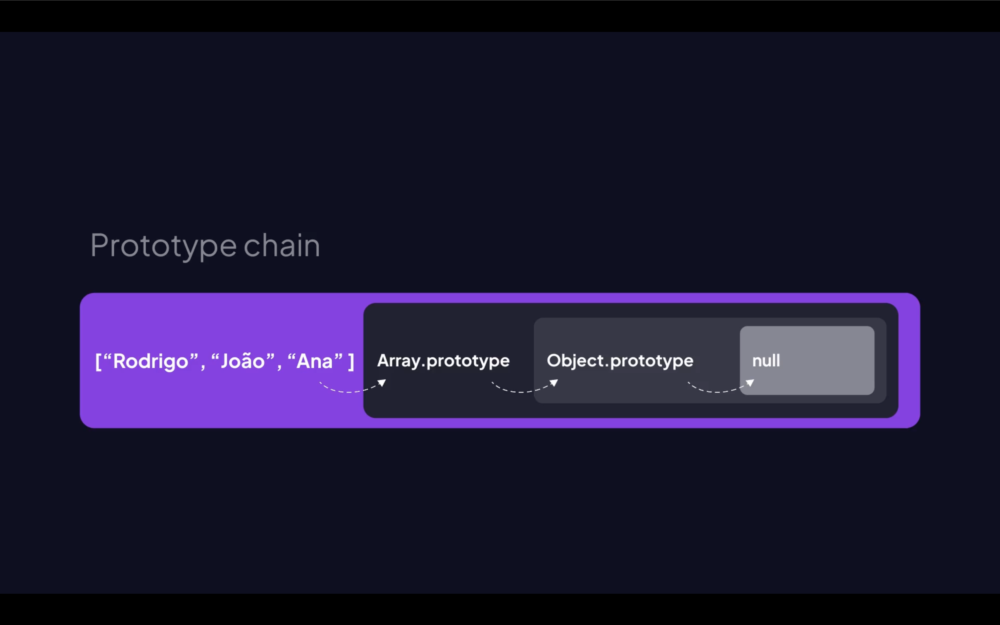

<h1 align="center">🧬 Herança e Cadeia de Protótipos em JavaScript <br>
</h1>

<p align="center">


</p>


<h2 align="center">📖 Introdução</h2>

No JavaScript, a **herança** funciona através de algo chamado **cadeia de protótipos (Prototype Chain)**.

Isso significa que **objetos podem herdar propriedades e métodos de outros objetos**.

Esse mecanismo permite:

- <mark>Reutilização de código;</mark>
- <mark>Compartilhamento de métodos;</mark>
- <mark>Criação de hierarquias de objetos;</mark>
- <mark>Extensão de funcionalidades.</mark>

---

<h2 align="center">🧠 O que é um Protótipo? <br>
</h2>

Todo **objeto em JavaScript possui um protótipo**.

O protótipo é um **objeto especial que serve como base para herança**.

Quando tentamos acessar uma propriedade:

1. O JavaScript procura no próprio objeto;
2. Se não encontrar, procura no **protótipo**;
3. Continua subindo na **cadeia de protótipos** até encontrar ou chegar ao final.

---

# 🔗 Cadeia de Protótipos

A **cadeia de protótipos** é o caminho que o JavaScript percorre para encontrar uma propriedade.

Exemplo simplificado:
Objeto → Prototype → Prototype → Object.prototype → null

---

<h2 align="center">🏗 Criando Herança com Prototype <br>
</h2>

Podemos criar herança manualmente usando **prototype**.

```js
function Animal(nome){
    this.nome = nome;
}

Animal.prototype.falar = function(){
    console.log(`${this.nome} fez um som`);
};
```

Agora criamos outro "tipo" de objeto herdando de Animal.
```js
function Cachorro(nome){
    this.nome = nome;
}

Cachorro.prototype = Object.create(Animal.prototype);
```

📌 Criando um Objeto
```js
const dog = new Cachorro("Rex");

dog.falar();
```

Resultado:
```js
Rex fez um som
```

Isso acontece porque Cachorro herdou o prototype de Animal.

<h2 align="center">⚙️ Adicionando Métodos na Classe Filha <br> </h2>
Podemos adicionar novos métodos apenas ao Cachorro.

```js
Cachorro.prototype.latir = function(){
    console.log(`${this.nome} está latindo`);
};
```
📌 Utilizando o método
```js
const dog = new Cachorro("Rex");

dog.falar();
dog.latir();
```

Resultado:
```js
Rex fez um som
Rex está latindo
```

<h2 align="center">🧬 Herança usando Classes (ES6)</h2>

Com classes, o JavaScript usa prototype internamente, mas de forma mais simples.
```js
class Animal {

    constructor(nome){
        this.nome = nome;
    }

    falar(){
        console.log(`${this.nome} fez um som`);
    }

}
```

Classe filha:
```js
class Cachorro extends Animal {

    latir(){
        console.log(`${this.nome} está latindo`);
    }

}
```

📌 Exemplo
```js
const dog = new Cachorro("Rex");

dog.falar();
dog.latir();
```

Resultado:
```js
Rex fez um som
Rex está latindo
```

<h2 align="center">🔍 Como funciona por trás?</h2>
Mesmo usando class, o JavaScript continua usando prototypes.
Exemplo:

```js
console.log(Cachorro.prototype);
console.log(Animal.prototype);
```

Isso mostra que os métodos são armazenados no prototype da classe.
🧪 Verificando a Cadeia de Protótipos
Podemos verificar a cadeia usando:
```js
console.log(Object.getPrototypeOf(dog));
```

Ou:
```js
console.log(dog.__proto__);
```

<h2 align="center">📊 Resumo</h2>

## Herança em JavaScript funciona através de prototypes.
Características principais:

- Objetos herdam de outros objetos;
- Metodos podem ser compartilhados;
- Existe uma cadeia de busca chamada Prototype Chain;
- Classes são apenas açúcar sintático para prototypes.

🚀 Exemplo Completo
```js
class Usuario {

    constructor(nome){
        this.nome = nome;
    }

    apresentar(){
        console.log(`Olá, meu nome é ${this.nome}`);
    }

}

class Admin extends Usuario {

    deletarUsuario(){
        console.log(`${this.nome} deletou um usuário`);
    }

}

const admin = new Admin("Lucas");

admin.apresentar();
admin.deletarUsuario();
```

Resultado
```js
Olá, meu nome é Lucas
Lucas deletou um usuário
```