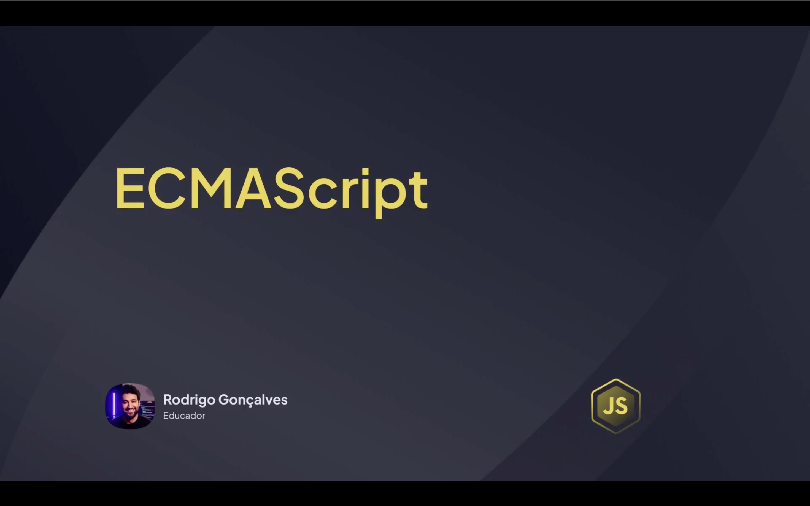
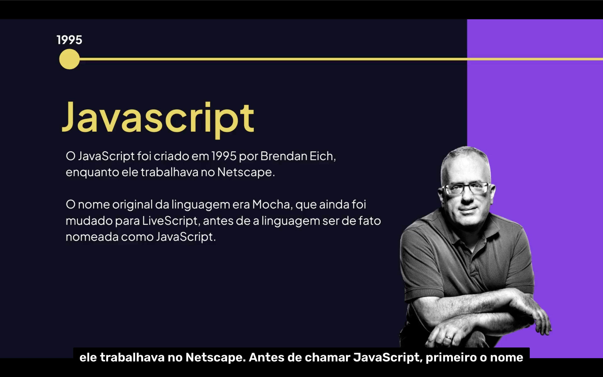
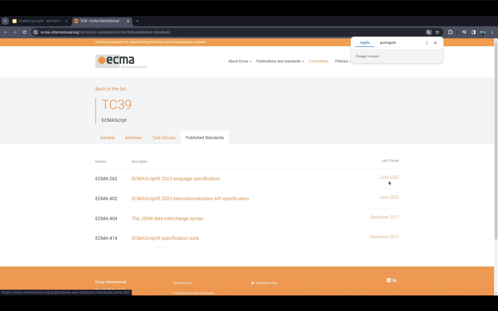

<h1 align="center">📜 ECMAScript (ES) <br>
</h1>

<p align="center">


</p>

---

<h2 align="center">📖 Introdução</h2>

O **ECMAScript (ES)** é o **padrão oficial da linguagem JavaScript**.

Ele define **regras, sintaxe e funcionalidades** que os navegadores e ambientes como **Node.js** devem seguir.

📌 Em outras palavras:

> **JavaScript é a implementação mais conhecida do padrão ECMAScript.**

O padrão ECMAScript é mantido pela organização **ECMA International**.

---

<h2 align="center">📜 O que o ECMAScript define? <br>
</h2>

O <mark style="background-color: pink">ECMAScript</mark> define diversos aspectos da linguagem:

- <mark>Sintaxe da linguagem;</mark>
- <mark>Tipos de dados;</mark>
- <mark>Estruturas de controle;</mark>
- <mark>Objetos e funções;</mark>
- <mark>Manipulação de arrays;</mark>
- <mark>Herança e protótipos.</mark>

<mark style="background-color: red">Ele **não define**</mark> coisas como:

- DOM;
- HTML;
- CSS;
- APIs do navegador.

Essas funcionalidades são adicionadas pelos **navegadores ou ambientes de execução**.

---

<h2 align="center">📅 Evolução do ECMAScript</h2>

Ao longo do tempo, várias versões foram lançadas trazendo novos recursos.

Principais versões:

| Versão | Ano | Principais Recursos |
|------|------|----------------|
| ES1 | 1997 | Primeira versão do padrão |
| ES3 | 1999 | Melhorias na linguagem |
| ES5 | 2009 | JSON, strict mode |
| ES6 (ES2015) | 2015 | Classes, arrow functions, let e const |
| ES7+ | 2016+ | Atualizações anuais |

Hoje o ECMAScript recebe **atualizações todos os anos**.

---

<h2 align="center">🚀 Principais Recursos do ES6</h2>

O **ECMAScript 2015 (ES6)** foi a maior atualização da linguagem.

Alguns recursos importantes:

- <mark>let e const;</mark>
- <mark>Arrow Functions;</mark>
- <mark>Classes;</mark>
- <mark>Template Strings;</mark>
- <mark>Destructuring;</mark>
- <mark>Modules.</mark>

---

<h2 align="center">🔤 Exemplo com let e const</h2>

Antes do ES6 utilizávamos apenas **var**.

```js
var nome = "Lucas";
Com ES6 podemos usar:
let idade = 20;
const PI = 3.14;
```

Diferença:
```js
let → valor pode mudar;
const → valor não pode ser reatribuído.
```

---

<h2 align="center">🏹 Arrow Functions</h2>

## Funções podem ser escritas de forma mais curta. <br> Antes:

```js
function soma(a, b){
    return a + b;
}
```

## Com ES6:
```js
const soma = (a, b) => a + b;
```

<h2 align="center">🏛 Classes em ECMAScript</h2>
O ES6 introduziu classes, facilitando a programação orientada a objetos.

```js
class Usuario {

    constructor(nome){
        this.nome = nome;
    }

    apresentar(){
        console.log(`Olá, meu nome é ${this.nome}`);
    }

}
```

## Criando um objeto:
```js

const user = new Usuario("Lucas");

user.apresentar();
```

## Resultado:
```js
Olá, meu nome é Lucas
```

<h2 align="center">📦 Módulos (Import / Export)</h2>
O ECMAScript também introduziu módulos, permitindo dividir o código.

## Arquivo: usuario.js
```js
export function saudacao(nome){
    return `Olá ${nome}`;
}
```

## Arquivo main.js
```js
import { saudacao } from "./usuario.js";

console.log(saudacao("Lucas"));
```

<h2 align="center">🔍 ECMAScript vs JavaScript</h2>
ECMAScript	JavaScript
É o padrão da linguagem	É a implementação
Define regras	Executa o código
Mantido pela ECMA	Usado em navegadores

<h2 align="center">📊 Resumo</h2>
Principais pontos sobre ECMAScript:
ECMAScript é o padrão oficial do JavaScript;
Define sintaxe e funcionamento da linguagem;
Recebe atualizações anuais;
ES6 trouxe grandes melhorias como classes, arrow functions e módulos;
JavaScript moderno segue o padrão ECMAScript.


<h2 align="center">🌐 Site Oficial do ECMAScript <br>
</h2>

<p align="center">
Para acessar a documentação oficial e acompanhar as atualizações da linguagem:
</p>

<p align="center">
<a href="https://tc39.es/ecma262/" target="_blank">
https://tc39.es/ecma262/
</a>
</p>

<p align="center">
A especificação é mantida pelo comitê <strong>TC39</strong>, responsável pela evolução do JavaScript.
</p>


<h2 align="center">🧪 Exemplo Completo</h2>

```js
class Produto {

    constructor(nome, preco){
        this.nome = nome;
        this.preco = preco;
    }

    mostrar(){
        console.log(`${this.nome} custa R$ ${this.preco}`);
    }

}

const produto = new Produto("Notebook", 3500);

produto.mostrar();
```

## Resultado:
```js
Notebook custa R$ 3500
```

<h2 align="center">📚 Conclusão</h2>
O ECMAScript é a base de tudo que existe no JavaScript moderno.
Com ele, a linguagem evoluiu muito, permitindo:
Código mais organizado;
Programação orientada a objetos;
Modularização;
Novos recursos modernos.