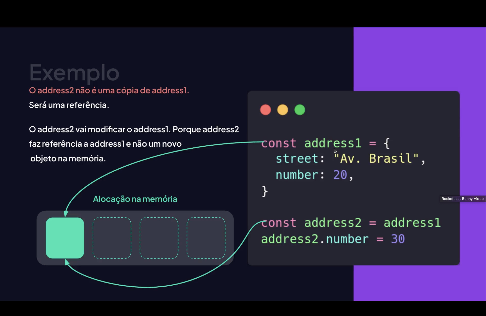
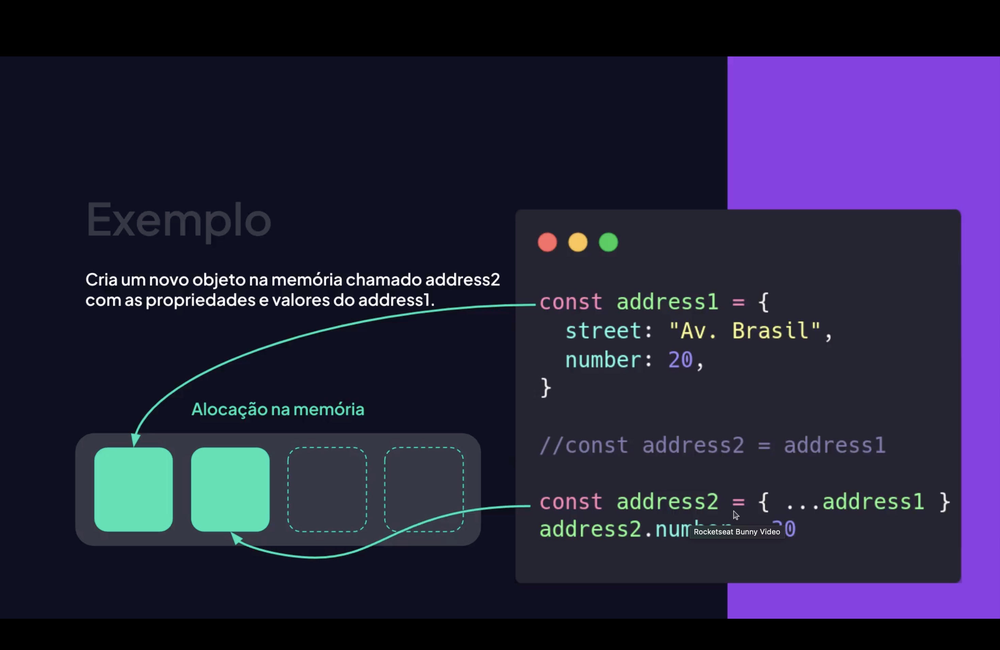
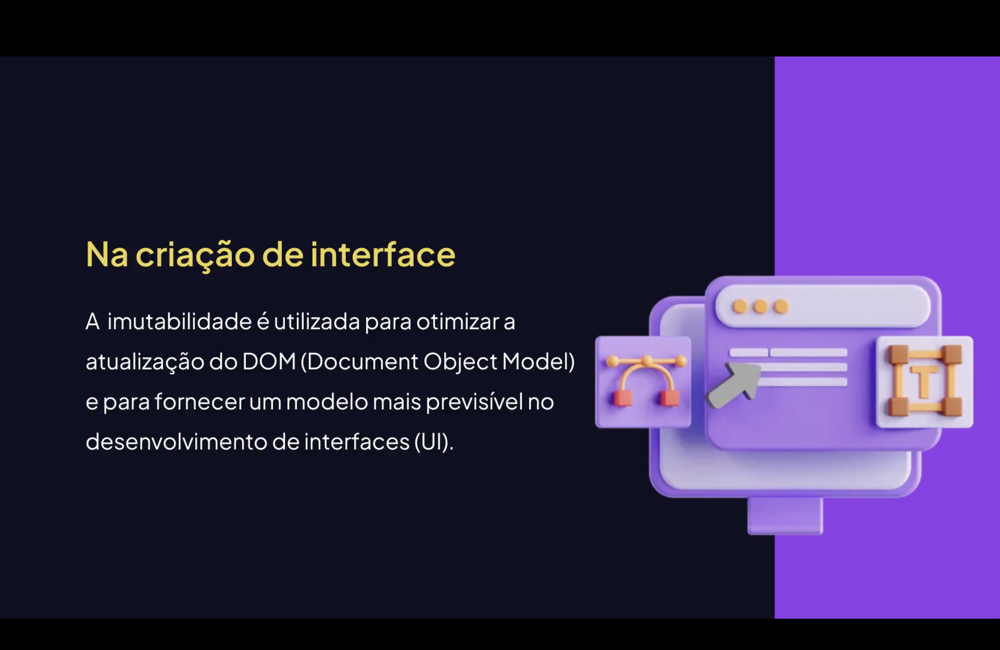
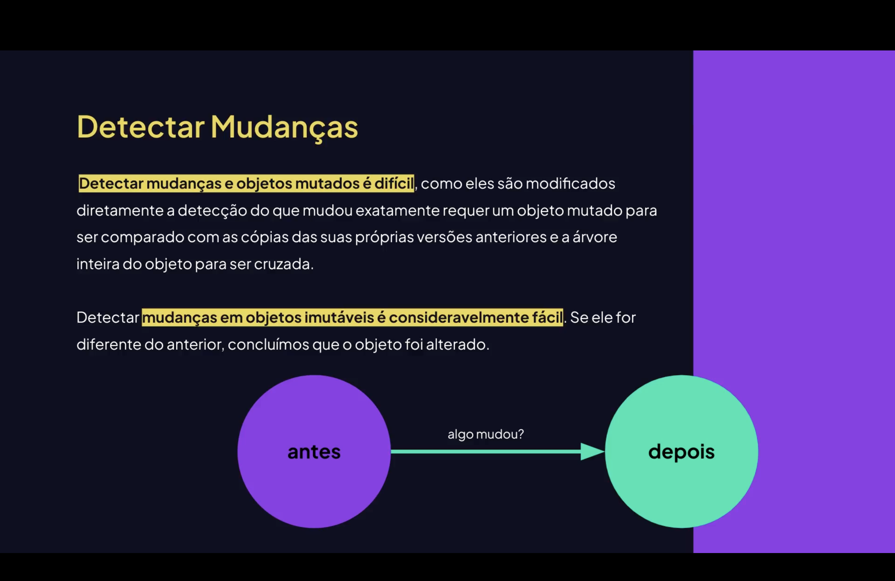

<h1 align="center">   Imutabilidade em JavaScript e Frameworks <br>
</h1>

<p align="center">


</p>

---

<h2 align="center">📖 Introdução</h2>

A **imutabilidade** é um conceito muito importante no **JavaScript moderno** e em diversos **frameworks**.

Ela significa que **um valor não deve ser alterado diretamente após ser criado**.

📌 Em vez de modificar um dado existente:

> Criamos **um novo valor baseado no anterior**.

Isso torna o código **mais previsível, seguro e fácil de debugar**.

---

<h2 align="center">🧠 O que é Imutabilidade? <br>
</h2>

Um dado **imutável** é um dado que **não pode ser alterado depois de criado**.

Exemplo de valor imutável:

```js
const nome = "Lucas";
```

Não podemos fazer:
```js
nome = "Pedro";
```
### Porque <mark>const<mark> não permite reatribuição. <br>
### Mas a imutabilidade vai além disso. Ela também envolve não modificar objetos ou arrays diretamente.
<h2 align="center">⚠️ Mutação de Objetos <br> </h2>
Objetos podem ser mutáveis.
Exemplo:

```js
const usuario = {
    nome: "Lucas",
    idade: 20
};

usuario.idade = 21;
```

## Aqui estamos modificando diretamente o objeto. <br>
Isso é chamado de mutação.

<h2 align="center">✅ Imutabilidade com Spread</h2>
Em vez de alterar o objeto original, criamos uma nova cópia.

```js
const usuario = {
    nome: "Lucas",
    idade: 20
};

const novoUsuario = {
    ...usuario,
    idade: 21
};
```

Agora:
usuario permanece igual;
novoUsuario possui o valor atualizado.

<h2 align="center">📦 Imutabilidade em Arrays <br> </h2>
Arrays também podem sofrer mutação.
❌ Exemplo com mutação:

```js
const numeros = [1, 2, 3];

numeros.push(4);
```
Isso altera o array original.
✅ Forma imutável:
```js
const numeros = [1, 2, 3];

const novosNumeros = [...numeros, 4];
```

Agora criamos um novo array.

<h2 align="center">⚙ Métodos Imutáveis de Array</h2>
Alguns métodos não alteram o array original.
Exemplos:

```js
map();
filter();
slice();
concat().
```
Exemplo:
```js
const numeros = [1,2,3];

const dobrados = numeros.map(n => n * 2);

```
Resultado:
```js
[2,4,6]
```

O array original não foi alterado.
<h2 align="center"> Imutabilidade em Frameworks <br> </h2>
Frameworks modernos utilizam muito o conceito de imutabilidade.
Principais exemplos:

- React;
- Redux;
- Vue;
- Angular.
<br><br>
A imutabilidade ajuda os frameworks a:
Detectar mudanças no estado;
Atualizar a interface de forma eficiente;
Evitar efeitos colaterais.
<h2 align="center"> Exemplo em React: </h2>
Atualização de estado de forma imutável:

```js
const [usuarios, setUsuarios] = useState([]);

setUsuarios([...usuarios, novoUsuario]);
```

Aqui criamos um novo array em vez de alterar o existente.
<h2 align="center">🧬 Imutabilidade e Programação Funcional <br> </h2>
A imutabilidade é um princípio da programação funcional.
Benefícios:

- código previsível;
- menos bugs;
- melhor manutenção;
- facilidade para testes.
<br><br>
Linguagens funcionais como <mark style="background-color: pink">Haskell</mark> utilizam imutabilidade por padrão.
<h2 align="center">🛠 Ferramentas para Imutabilidade <br> </h2>
Algumas bibliotecas ajudam a trabalhar com dados imutáveis.
Exemplos:

- Immer;
- Immutable.js;
- Redux Toolkit;
Exemplo com Immer:
- import produce from "immer".
```js
const novoEstado = produce(estado, draft => {
    draft.contador += 1;
});
```

<h2 align="center">🧪 Exemplo Completo</h2>

```js
const carrinho = [
    { produto: "Mouse", preco: 100 },
    { produto: "Teclado", preco: 200 }
];

const novoCarrinho = [
    ...carrinho,
    { produto: "Monitor", preco: 900 }
];

console.log(carrinho);
console.log(novoCarrinho);
```

Resultado:
```js
[
 { produto: "Mouse", preco: 100 },
 { produto: "Teclado", preco: 200 }
]

[
 { produto: "Mouse", preco: 100 },
 { produto: "Teclado", preco: 200 },
 { produto: "Monitor", preco: 900 }
]
```