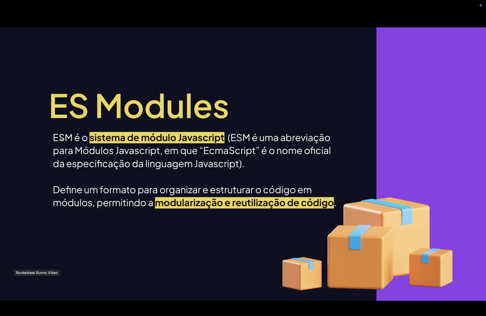

<h1 align="center">  Módulos em JavaScript (ES Modules) <br>
</h1>

<p align="center">


</p>

---

<h2 align="center">📖 Introdução</h2>

Os **módulos em JavaScript** permitem **dividir o código em vários arquivos menores**.

Cada arquivo pode possuir **funções, variáveis ou classes específicas**, tornando o código **mais organizado e reutilizável**.

📌 Em vez de escrever tudo em um único arquivo grande:

> Criamos **módulos separados que podem ser importados quando necessário**.

Isso melhora:

- organização do projeto;
- manutenção do código;
- reutilização de funcionalidades.

---

<h2 align="center">📦 O que são Módulos? <br>
</h2>

Um <mark style="background-color: pink">**módulo**</mark> é simplesmente **um arquivo JavaScript que exporta ou importa código**.

Cada módulo possui **seu próprio escopo**, evitando conflitos entre variáveis.

Exemplo de módulo:

```js
// matematica.js

export const soma = (a, b) => {
    return a + b;
};
```

Agora, podemos usar essa função em outro arquivo.

<h2 align="center">📤 Exportando Código: </h2>
Para disponibilizar algo em um módulo usamos export.
Existem duas formas principais:

- 1 - Export Nomeado:
```js
export const PI = 3.14;

export function soma(a, b) {
    return a + b;
}
```

Podemos exportar várias coisas no mesmo arquivo.

- 2 - Export Default
Permite exportar um valor principal do módulo.
```js
export default function multiplicar(a, b) {
    return a * b;
}
```

Cada arquivo pode ter apenas um export default.

<h2 align="center">📥 Importando Módulos: </h2>
Para utilizar um módulo usamos import.
Exemplo:

```js
import { soma } from "./matematica.js";

console.log(soma(2,3));
Importando export default:
import multiplicar from "./multiplicar.js";
```

Também é possível importar tudo de um módulo:
```js
import * as matematica from "./matematica.js";

console.log(matematica.soma(2,3));
```

<h2 align="center"> 📂 Vantagens dos Módulos: </h2>
<strong>Utilizar módulos traz diversos benefícios:
melhor organização do projeto;
reutilização de código;
separação de responsabilidades;
redução de conflitos de variáveis;
manutenção mais fácil.
Projetos grandes podem possuir centenas de módulos trabalhando juntos.</strong>

<h2 align="center">🧠 Módulos em Projetos Modernos <br> </h2>

Frameworks e ferramentas modernas utilizam módulos intensivamente.
Exemplos:

- React;
- Vue;
- Angular;
- Node.js.

<br><br>

Cada componente, serviço ou utilidade normalmente fica em um módulo separado.
Exemplo em React:

```js
import Header from "./components/Header";
import Footer from "./components/Footer";
```

Cada componente é um módulo reutilizável.

<h2 align="center">🌋 Módulos e Escalabilidade: </h2>
Em aplicações grandes, os módulos são essenciais para escala do projeto.
Eles permitem:

- dividir o sistema em partes menores;
- trabalhar em equipe com mais facilidade;
- manter o código limpo;
- facilitar testes unitários.

<br><br>

Por isso, praticamente todo projeto moderno em JavaScript utiliza módulos.

<h2 align="center">🧪 Exemplo Completo: </h2>

```js
matematica.js
export function soma(a, b) {
    return a + b;
}

export function subtrair(a, b) {
    return a - b;
}
app.js
import { soma, subtrair } from "./matematica.js";

console.log(soma(10,5));
console.log(subtrair(10,5));
```

Resultado:

```js
15
5
```
