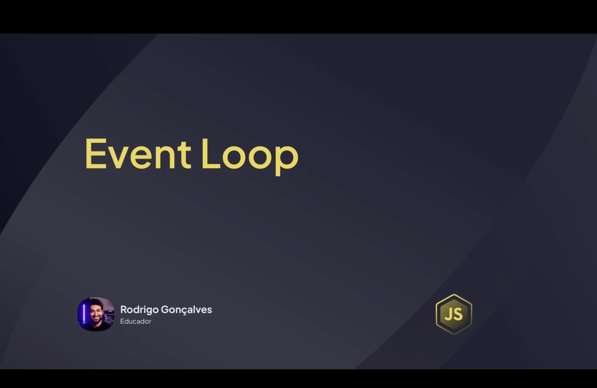
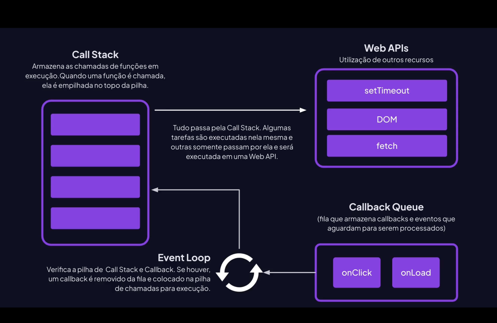
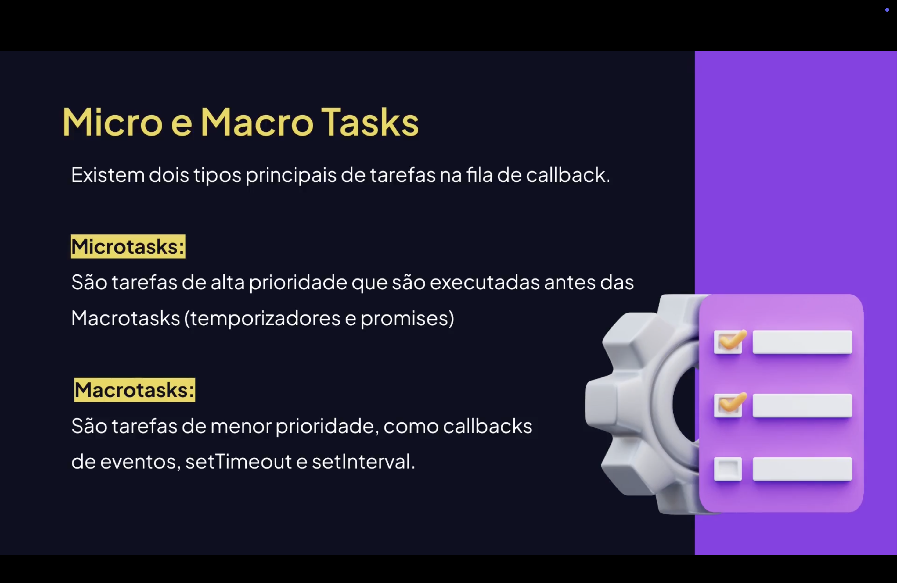

<h1 align="center">  Event Loop em JavaScript <br>
</h1>

<p align="center">


</p>

---

<h2 align="center">📖 O que é o Event Loop?</h2>

O **Event Loop** é o mecanismo que permite ao **JavaScript executar operações assíncronas** mesmo sendo uma linguagem **single-thread**.

Ele organiza a execução do código através de estruturas como:

- Call Stack;
- Web APIs;
- Callback Queue;
- Microtask Queue.

Seu objetivo é **evitar bloqueios na execução do programa**, permitindo que tarefas demoradas aconteçam em segundo plano.

---

<h2 align="center">🧠 Estrutura do Event Loop</h2>



O funcionamento envolve quatro partes principais:

**Call Stack**

É a pilha onde funções são executadas.

```js
function a(){
    b();
}

function b(){
    console.log("Executando função B");
}

a();
```
Fluxo:
Call Stack
```js
a()
b()
console.log()
```

<h2 align="center">🌐 Web APIs</h2>  <br>
Algumas operações são executadas fora da Call Stack.
Exemplos:

setTimeout;
requisições HTTP;
eventos do DOM;
leitura de arquivos.
Exemplo:
setTimeout(() => {
    console.log("Executado depois");
}, 2000);
<h2 align="center">📬 Callback Queue</h2> 
Quando uma operação termina nas Web APIs, sua função é enviada para a Callback Queue.
Exemplo:

setTimeout(() => {
    console.log("Callback executado");
}, 1000);
Ela espera até que a Call Stack esteja vazia para ser executada.
<h2 align="center">⚡ Microtask Queue</h2> 
Algumas tarefas possuem prioridade maior e entram na Microtask Queue.
Exemplos:

Promises (.then);
queueMicrotask;
MutationObserver.
Exemplo:
```js
Promise.resolve().then(() => {
    console.log("Microtask executada");
});
```

Microtasks executam antes da Callback Queue.

<h2 align="center">🔁 Funcionamento do Event Loop</h2> 
O Event Loop verifica constantemente:

- se a Call Stack está vazia;
- se existem tarefas na Microtask Queue;
- depois verifica a Callback Queue.
Fluxo simplificado:

Call Stack vazia?

↓ SIM

Executa Microtasks

↓ depois

Executa Callback Queue

<h2 align="center">🧪 Exemplo Prático: </h2>

```js
console.log("1");

setTimeout(() => {
    console.log("2");
}, 0);

Promise.resolve().then(() => {
    console.log("3");
});

console.log("4");
```

Resultado:
```js
1
4
3
2
```

## Explicação:
1 → executa imediatamente;
4 → executa imediatamente;
3 → microtask (Promise);
2 → callback queue (setTimeout).

<h2 align="center">📊 Visualização Geral: </h2>
Fluxo:
Call Stack
->
Web APIs
->
Callback Queue
->
Event Loop
->
Execução