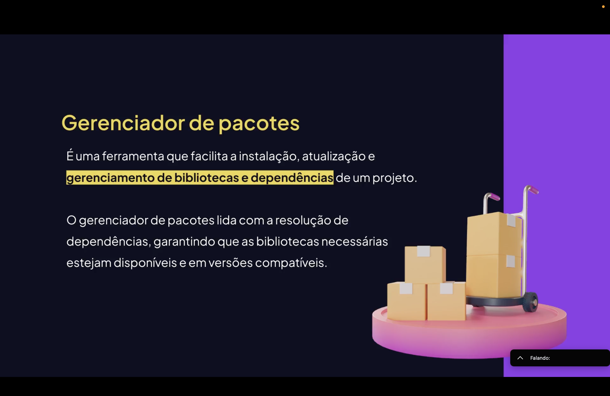
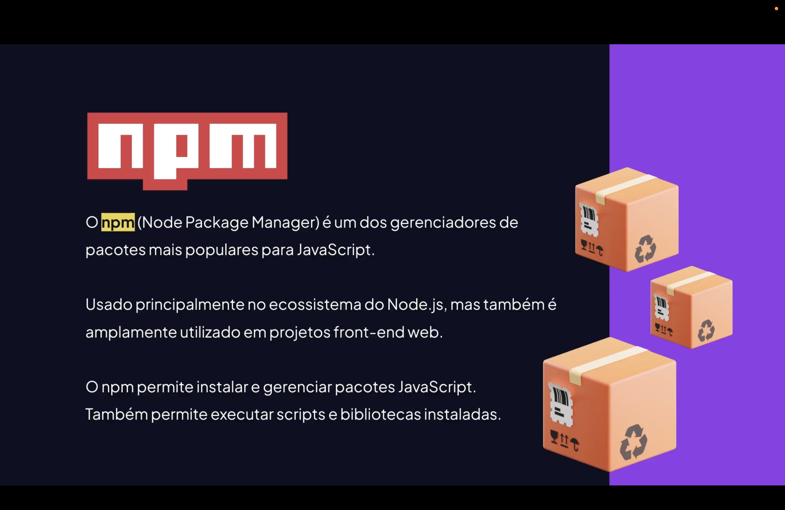
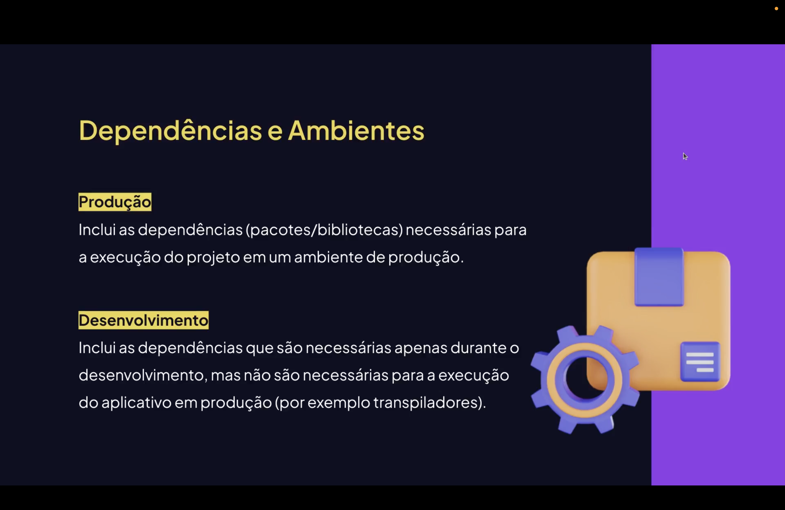

<h1 align="center">  Gestão de Pacotes em JavaScript (NPM) <br>
</h1>

<p align="center">


</p>

---

<h2 align="center">📖 O que é Gestão de Pacotes? <br>
</h2>

A **gestão de pacotes** em JavaScript é o processo de **instalar; atualizar; remover; e organizar dependências** utilizadas em um projeto.

Essas dependências são bibliotecas externas que fornecem funcionalidades prontas, permitindo que os desenvolvedores não precisem criar tudo do zero.

Exemplos de funcionalidades fornecidas por pacotes:

- manipulação de datas;
- comunicação com APIs;
- frameworks web;
- validação de dados;
- ferramentas de desenvolvimento.

O principal sistema responsável por essa gestão é3o **NPM (Node Package Manager)**.

---

<h2 align="center">📦 NPM (Node Package Manager) <br>
</h2>


O **NPM** é o gerenciador de pacotes padrão do **Node.js**.

Ele permite:

- instalar dependências;
- atualizar versões;
- remover bibliotecas;
- compartilhar pacotes com a comunidade;
- automatizar tarefas de desenvolvimento.

Ele também conecta o projeto ao **repositório público do NPM**, que contém **milhões de bibliotecas disponíveis**.

---

<h2 align="center">🚀 Inicializando um Projeto: <br>
</h2>

Antes de instalar pacotes, é necessário inicializar o projeto.

```bash
npm init -y
```

Esse comando cria o arquivo:

```bash
package.json
```

Esse arquivo será responsável por gerenciar todas as dependências do projeto
.
<h2 align="center">📄 package.json <br>
 </h2> 
O package.json contém as informações principais do projeto.
Exemplo:

```json
{
  "name": "meu-projeto",
  "version": "1.0.0",
  "description": "Projeto exemplo",
  "main": "index.js",
  "scripts": {
    "start": "node index.js"
  },
  "dependencies": {
    "axios": "^1.6.0"
  },
  "devDependencies": {
    "nodemon": "^3.0.0"
  }
}
```

Principais campos:
- name;
- version;
- scripts;
- dependencies;
- devDependencies.

<h2 align="center">📥 Instalando Pacotes: </h2>

Instalação de dependências no projeto:
- npm install axios

ou

- npm i axios

O NPM irá:
- baixar o pacote;
- salvar dentro da pasta node_modules;
- registrar a dependência no package.json.

<h2 align="center">🧪 Dependências de Desenvolvimento: </h2>

Algumas bibliotecas são utilizadas apenas durante o desenvolvimento.
Exemplo:
- npm install nodemon --save-dev
Essas dependências ficam registradas em:
- devDependencies

Exemplos de ferramentas de desenvolvimento:
- nodemon;
- eslint;
- prettier;
- jest.

<h2 align="center">🧰 node_modules: </h2>
A pasta node_modules contém todas as bibliotecas instaladas no projeto.
Características:

- pode conter milhares de arquivos;
- é criada automaticamente;
- depende das dependências do package.json;
- não deve ser enviada para o repositório Git.
- Arquivo .gitignore:
- node_modules/

<h2 align="center">🔄 Atualizando Pacotes</h2>
Atualizar uma dependência específica:

- npm update nome-do-pacote
Atualizar todas as dependências:

- npm update
Também é possível verificar versões desatualizadas:

- npm outdated

<h2 align="center">🗑️ Removendo Pacotes</h2>
Para remover um pacote do projeto:

- npm uninstall axios

O NPM irá:
- remover da pasta node_modules;
- remover do package.json.

<h2 align="center">⚙️ Scripts NPM</h2>
Scripts permitem automatizar comandos no projeto.
Exemplo:

```json
"scripts": {
  "start": "node index.js",
  "dev": "nodemon index.js",
  "test": "jest"
}
```

Executando um script:

- npm run dev
Scripts ajudam a padronizar comandos dentro do projeto.

<h2 align="center">📊 Fluxo de Gestão de Pacotes</h2>
Fluxo básico de gerenciamento:
npm init
   ->
package.json criado
   ->
npm install pacote
   ->
node_modules criado
   ->
import no código
   ->
execução do projeto