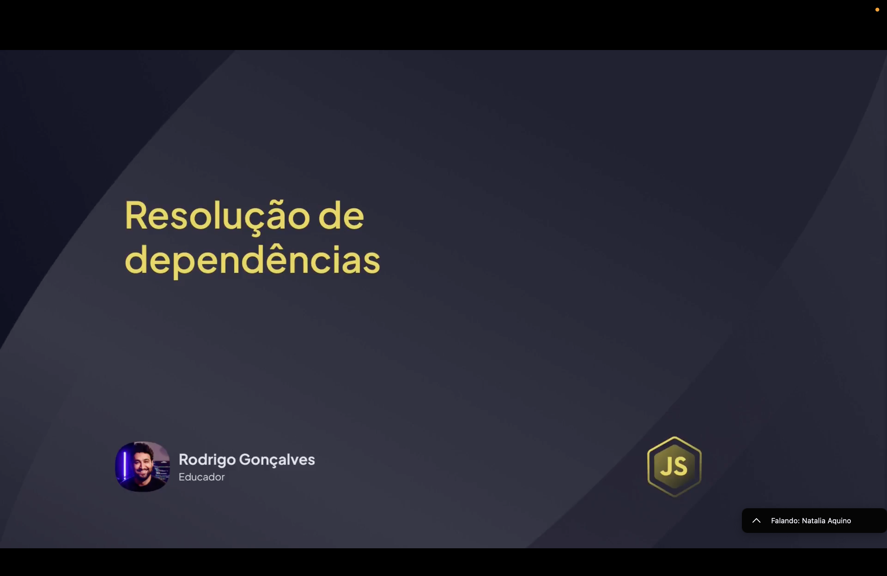
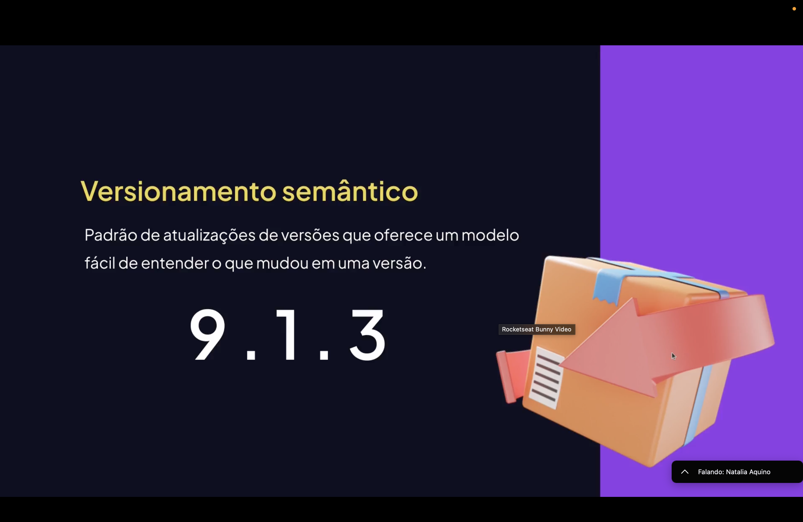
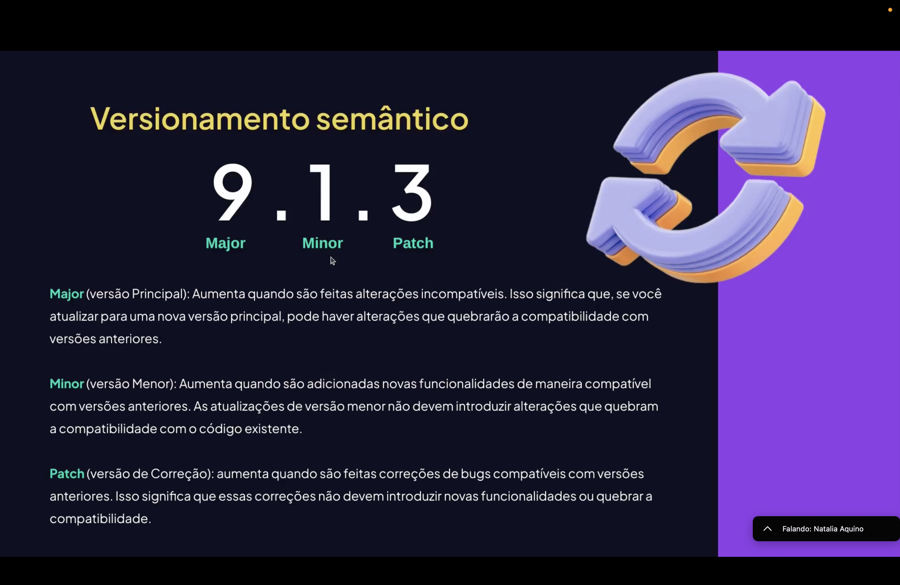
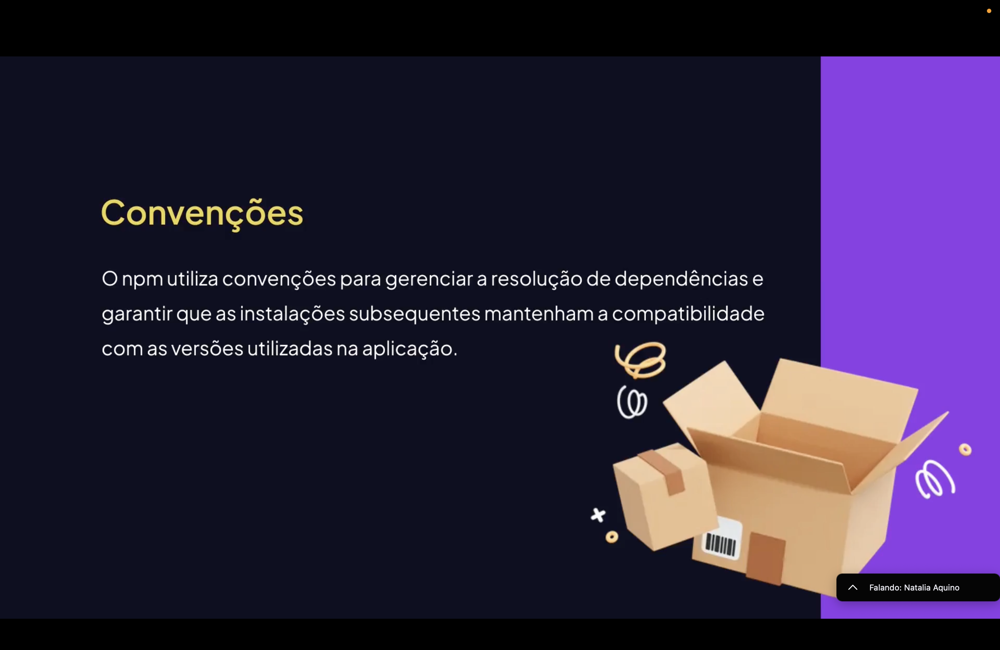
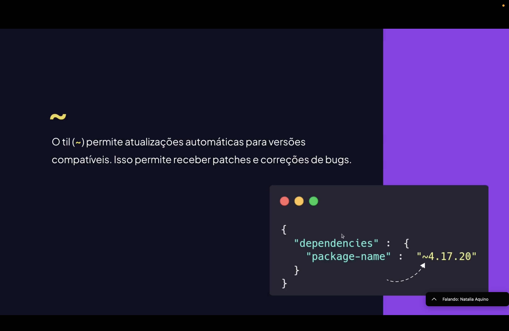
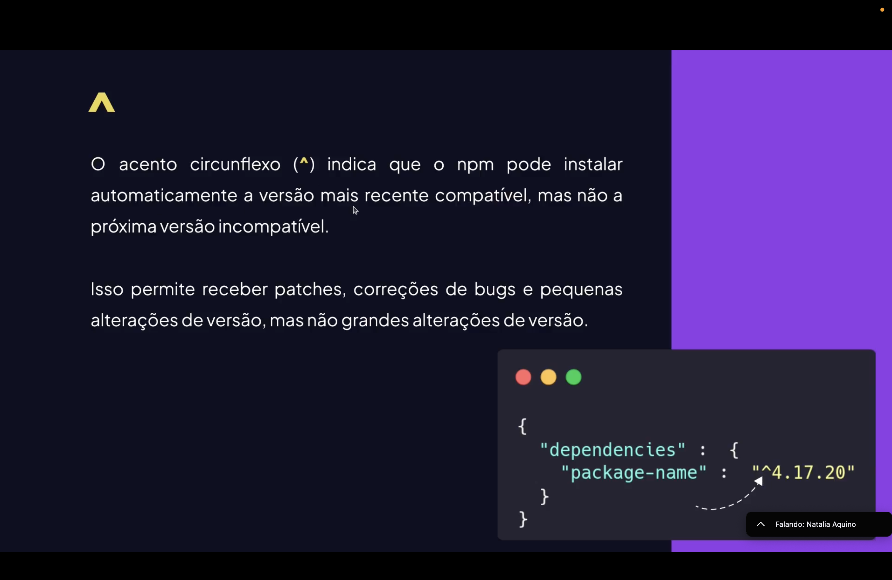
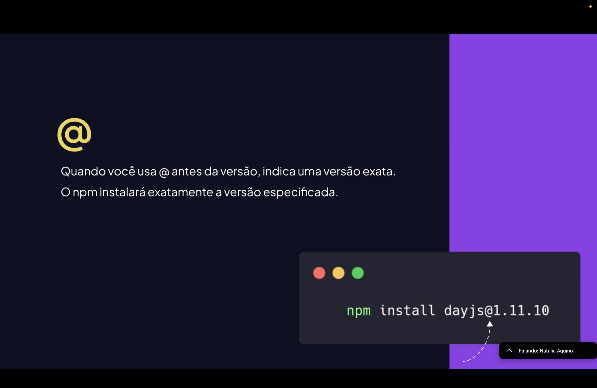

<h1 align="center">  Resolução de Dependências em JavaScript <br>
</h1>

<p align="center">


</p>

---

<h2 align="center">📖 O que é Resolução de Dependências? <br>
</h2>

A **resolução de dependências** é o processo que determina **quais versões de pacotes serão instaladas em um projeto** e como elas se relacionam entre si.

Quando um pacote é instalado, ele pode depender de **outros pacotes**, formando uma cadeia de dependências.

O gerenciador de pacotes precisa então:

- identificar dependências necessárias;
- resolver possíveis conflitos de versão;
- garantir compatibilidade entre bibliotecas;
- montar a árvore de dependências do projeto.

Esse processo é realizado automaticamente pelo **NPM**.

---

<h2 align="center">📦 Dependências Diretas e Indiretas <br>
</h2>

Existem dois tipos principais de dependências em um projeto.

**Dependências diretas**  
São aquelas instaladas diretamente pelo desenvolvedor.

Exemplo:
npm install axios

**Dependências indiretas (transitivas)**  
São pacotes necessários para que outra biblioteca funcione.

Exemplo:
<pre>
Projeto
└── axios
└── follow-redirects
</pre>

Ou seja, ao instalar **axios**, outras dependências também são instaladas automaticamente.

---

<h2 align="center">🌳 Árvore de Dependências <br>
</h2>

O NPM organiza os pacotes em uma **árvore de dependências** dentro da pasta:
node_modules

Essa estrutura mostra como as bibliotecas se relacionam.

Exemplo simplificado:
<pre>
node_modules
├── axios
├── lodash
└── chalk
</pre>

Cada pacote pode conter **suas próprias dependências internas**, criando uma estrutura hierárquica.

---

<h2 align="center">⚠️ Conflito de Versões <br>
</h2>

Um problema comum na resolução de dependências é o **conflito de versões**.

Isso ocorre quando diferentes bibliotecas exigem **versões diferentes de um mesmo pacote**.

Exemplo:
<strong>biblioteca A</strong> -> lodash v4
<strong>biblioteca B</strong> -> lodash v3

O gerenciador de pacotes precisa decidir:

- qual versão instalar;
- se será possível reutilizar uma versão;
- ou se será necessário instalar versões separadas.

---

<h2 align="center">🔒 package-lock.json <br>
</h2>

O arquivo **package-lock.json** registra exatamente:

- versões instaladas;
- dependências transitivas;
- estrutura da árvore de pacotes.

Isso garante que **todos os desenvolvedores do projeto utilizem as mesmas versões de dependências**.

Exemplo de trecho:

```json
"dependencies": {
  "axios": {
    "version": "1.6.0"
  }
}
```

Esse arquivo é criado automaticamente após o comando:
- npm install

<h2 align="center">🚀 Algoritmo de Resolução do NPM <br> </h2>

O NPM utiliza um processo automatizado para resolver dependências:

- lê o package.json;
- identifica dependências diretas;
- verifica dependências internas dos pacotes;
- resolve conflitos de versões;
- cria a árvore de dependências;
- instala tudo em node_modules;
- registra no package-lock.json.

Esse processo permite que projetos JavaScript mantenham consistência e compatibilidade entre bibliotecas.

<h2 align="center">📊 Fluxo de Resolução de Dependências</h2>
Fluxo simplificado:
npm install
     ->
leitura do package.json
     ->
identificação das dependências
     ->
resolução de versões
     ->
download dos pacotes
     ->
criação da árvore de dependências
     ->
instalação em node_modules
     ->
registro no package-lock.json