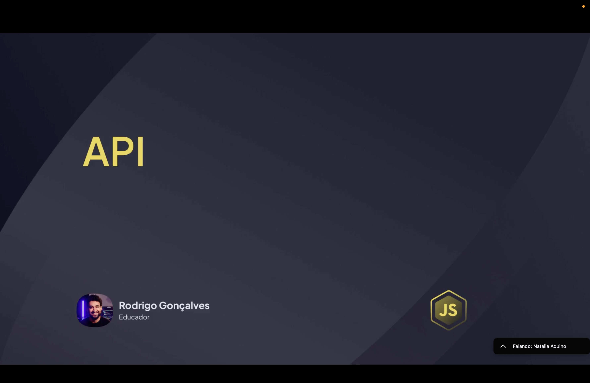
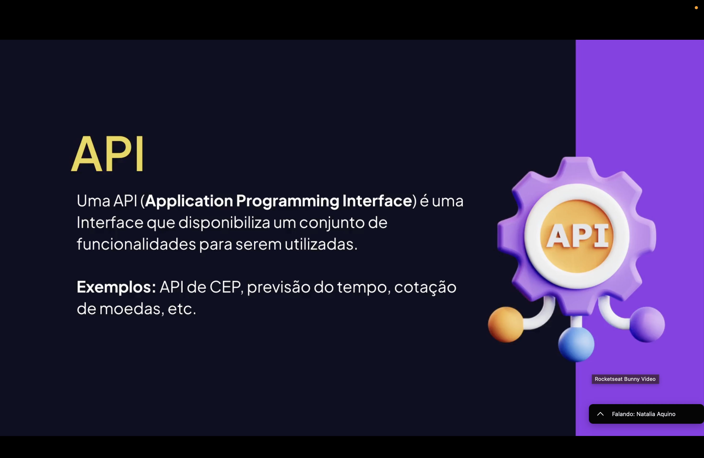
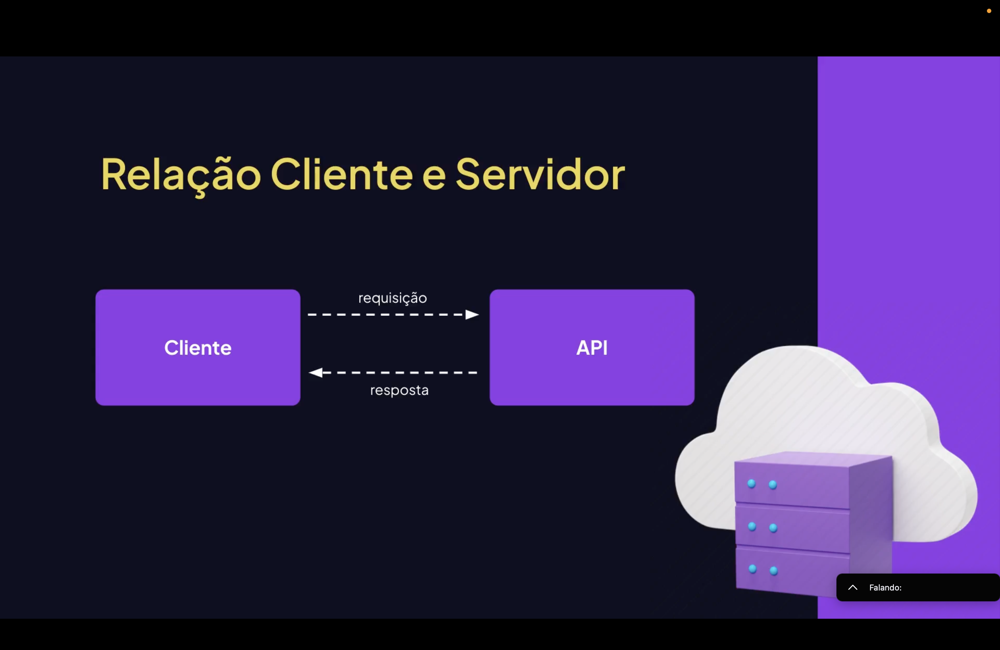
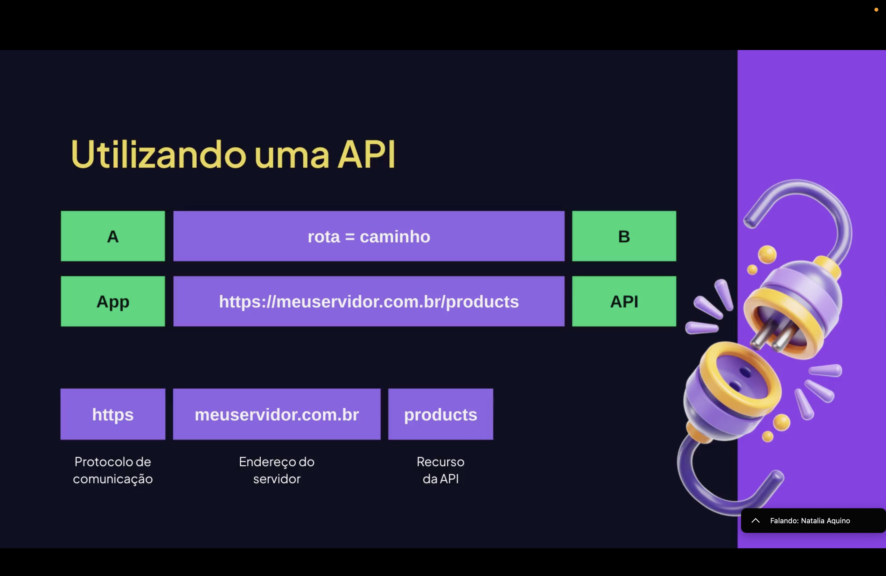
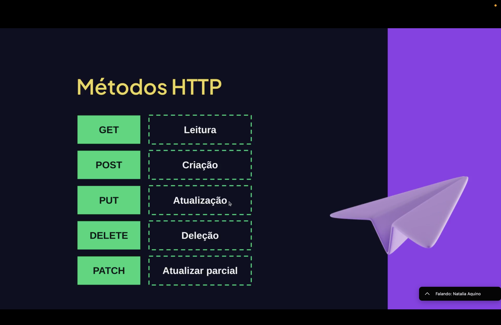
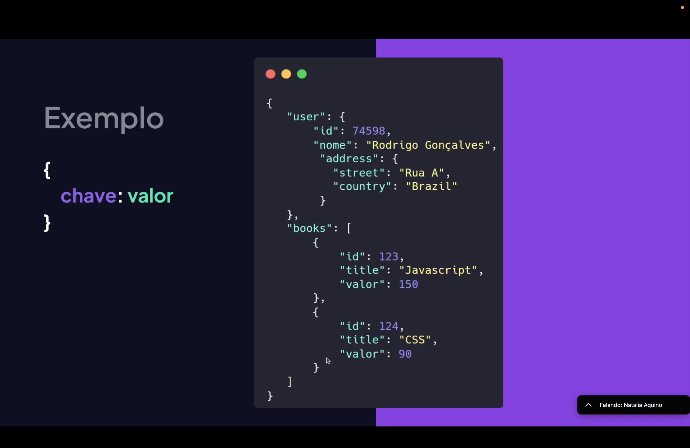

<h1 align="center">  APIs em JavaScript <br>
</h1>

<p align="center">


</p>

---

<h2 align="center">📖 O que é uma API? <br>
</h2>

Uma **API (Application Programming Interface)** é um conjunto de **regras e interfaces que permitem que diferentes sistemas se comuniquem entre si**.

Ela funciona como um **intermediário** entre aplicações, permitindo que um software utilize funcionalidades ou dados de outro sistema sem precisar conhecer sua implementação interna.

Em outras palavras, a API define **como uma aplicação pode solicitar serviços ou informações de outra aplicação**.

---

<h2 align="center">🔗 Como APIs Funcionam <br>
</h2>

O funcionamento de uma API geralmente envolve três elementos principais:

- **Cliente** → aplicação que faz a requisição;
- **Servidor** → sistema que fornece os dados ou serviços;
- **API** → interface que define como essa comunicação ocorre.

Fluxo simplificado:

<pre>
Aplicação (Cliente)
        ↓
      Requisição
        ↓
        API
        ↓
      Servidor
        ↓
      Resposta
</pre>

A API recebe a requisição, processa no servidor e retorna uma **resposta estruturada**, normalmente em formato **JSON**.

---

<h2 align="center">📦 APIs no Desenvolvimento Web <br>
</h2>

No desenvolvimento web, APIs são usadas para:

- acessar bancos de dados;
- integrar serviços externos;
- autenticar usuários;
- enviar ou receber informações entre aplicações.

Exemplo comum:

Um site de previsão do tempo pode consumir uma **API meteorológica** para exibir dados atualizados.

---

<h2 align="center">🌐 Requisições HTTP <br>
</h2>

APIs web normalmente utilizam o protocolo **HTTP** para comunicação.

Os métodos mais comuns são:

- **GET** → buscar dados;
- **POST** → enviar dados;
- **PUT** → atualizar dados;
- **DELETE** → remover dados.

Exemplo de requisição usando JavaScript:

```javascript
fetch("https://api.exemplo.com/usuarios")
  .then(resposta => resposta.json())
  .then(dados => console.log(dados));
```

Nesse exemplo, o código faz uma requisição para uma API e recebe os dados retornados pelo servidor.

<h2 align="center">⚙️ Tipos de APIs: </h2>

Existem diferentes tipos de APIs utilizadas no desenvolvimento de software.
- APIs Públicas
Disponíveis para qualquer desenvolvedor utilizar.
- APIs Privadas
Utilizadas internamente por uma empresa ou sistema.
- APIs de Parceiros

Compartilhadas entre organizações específicas.

Essas APIs permitem integração entre diferentes plataformas e serviços digitais.

<h2 align="center">📄 Formatos de Dados <br> </h2>
As APIs normalmente retornam dados em formatos estruturados.
Os mais utilizados são:
JSON (JavaScript Object Notation)
XML
Exemplo de resposta JSON:

```json
{
  "nome": "Lucas",
  "idade": 25,
  "cidade": "Recife"
}
```


Esse formato facilita a troca de dados entre sistemas.
