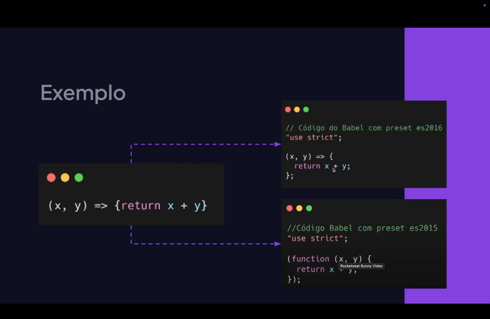

<h1 align="center">  Compiladores em JavaScript <br>
</h1>

<p align="center">


</p>

---

<h2 align="center">📖 O que é um Compilador? <br>
</h2>

Um <mark style="background-color: pink">**compilador**</mark> é um software responsável por **traduzir código escrito em uma linguagem de programação para outra linguagem**, geralmente de nível mais baixo ou mais próxima da máquina.

No contexto do <mark>**JavaScript**</mark>, compiladores são frequentemente utilizados para **transformar código moderno ou de outras linguagens em JavaScript compatível com navegadores**.

Esse processo permite que desenvolvedores utilizem **recursos mais avançados da linguagem** sem se preocupar com compatibilidade entre diferentes ambientes.

---

<h2 align="center">⚙️ Como Funciona um Compilador? <br>
</h2>

O funcionamento de um compilador geralmente segue algumas etapas principais:

- **Leitura do código fonte**;
- **Análise sintática**;
- **Transformação ou otimização do código**;
- **Geração do código final**.

Fluxo simplificado:

<pre>
Código Fonte
     ↓
   Compilador
     ↓
Transformação
     ↓
Código JavaScript
     ↓
 Execução no Navegador
</pre>

Esse processo permite que o código seja **adaptado para diferentes ambientes de execução**.

---

<h2 align="center">📦 Compiladores no Ecossistema JavaScript <br>
</h2>

No desenvolvimento moderno, compiladores são amplamente utilizados para:

- permitir o uso de **novos recursos da linguagem**;
- converter **TypeScript para JavaScript**;
- otimizar código para **melhor performance**;
- garantir **compatibilidade com navegadores antigos**.

Alguns compiladores populares incluem:

- **Babel**;
- **TypeScript Compiler (tsc)**;
- **SWC**.

Essas ferramentas fazem parte do processo de **build** das aplicações web.

---

<h2 align="center">💻 Exemplo de Transpilação <br>
</h2>

Um exemplo comum é o uso de **JavaScript moderno (ES6+)**, que pode ser transformado em uma versão compatível com navegadores mais antigos.

Código moderno:

```javascript
const soma = (a, b) => a + b;

Após a compilação (transpilação), pode ser convertido para:
var soma = function(a, b) {
  return a + b;
};
```

Isso garante que o código funcione em ambientes que ainda não suportam as funcionalidades mais recentes do JavaScript.

<h2 align="center">📄 Compilação vs Interpretação</h2>
No desenvolvimento de software, existem duas formas principais de executar código:


Compilação
O código é traduzido antes da execução.


Interpretação
O código é executado linha por linha durante a execução.


O JavaScript tradicionalmente é uma lingagem interpretada, mas ferramentas modernas permitem compilar ou transformar o código antes da execução, melhorando a compatibilidade e a organização dos projetos.