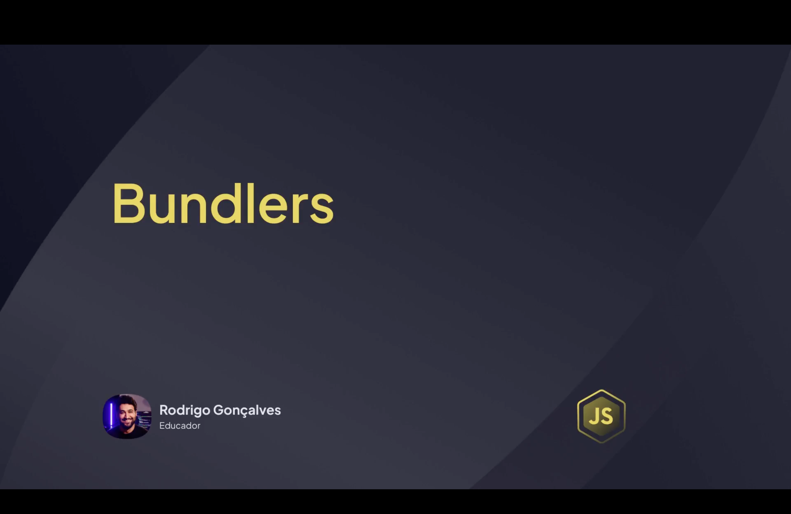
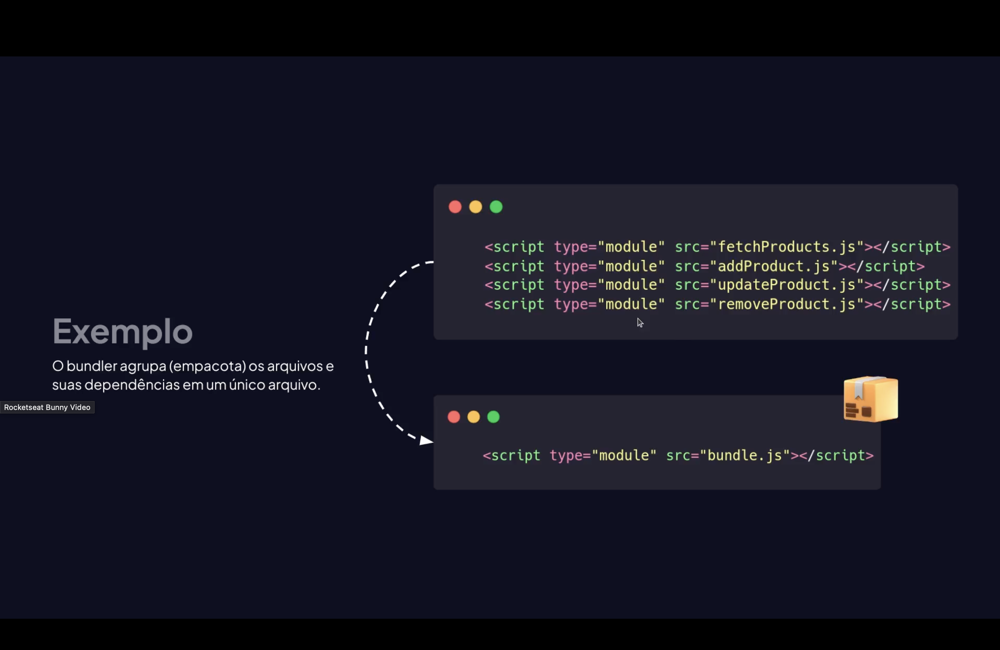
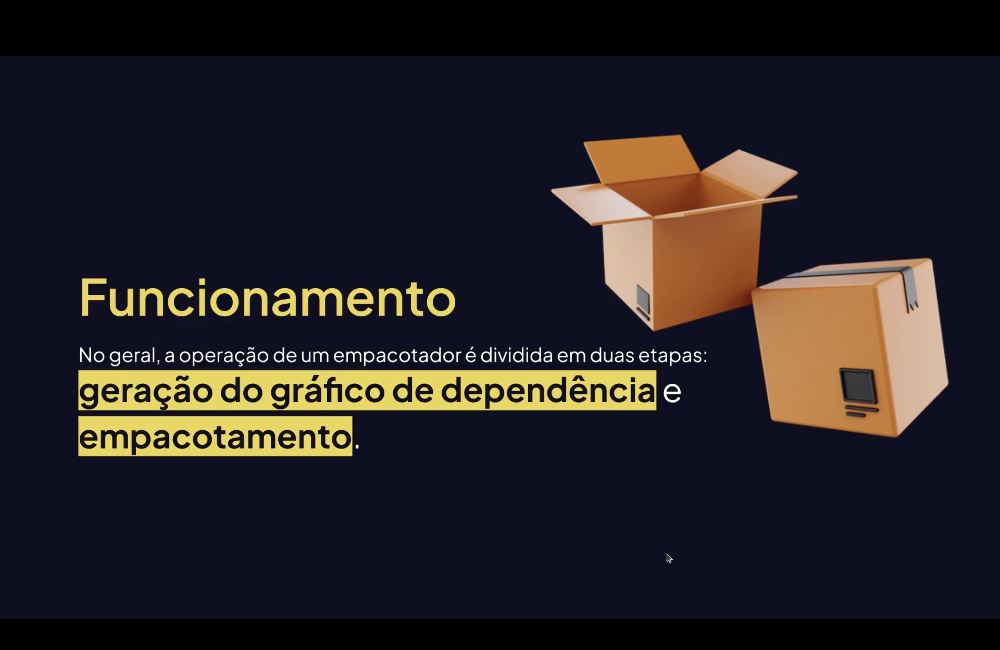
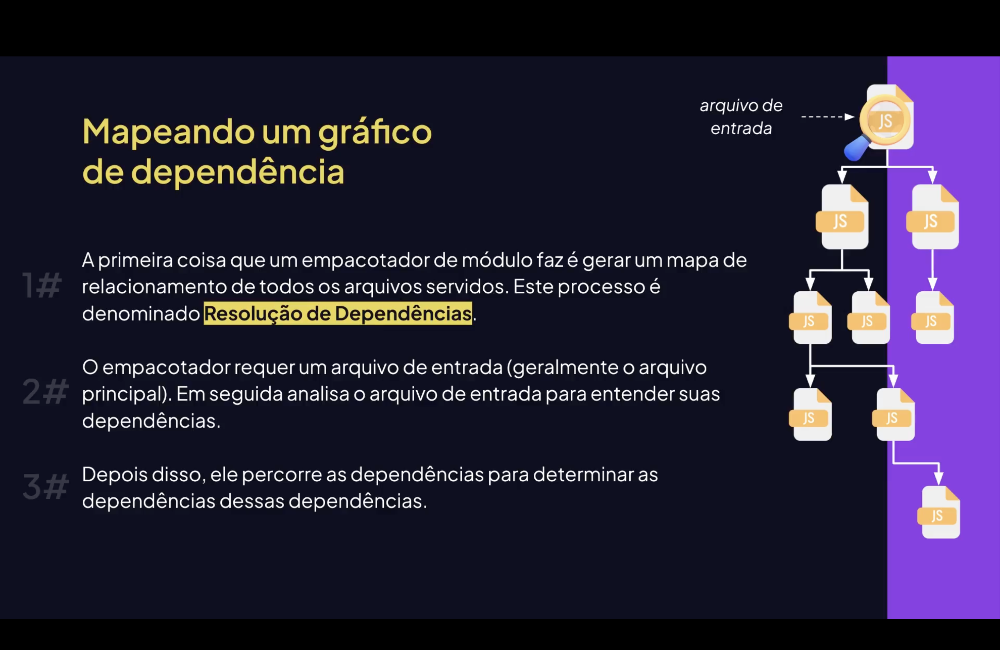

<h1 align="center">  Bundlers em JavaScript <br>
</h1>

<p align="center">


</p>

---

<h2 align="center">📖 O que é um Bundler? <br>
</h2>

Um <mark style="background-color: pink">**bundler**</mark> é uma ferramenta que **agrupa múltiplos arquivos JavaScript, CSS, imagens e outros recursos em um único arquivo ou poucos arquivos otimizados**.  

No desenvolvimento moderno, os bundlers são usados para:

- reduzir a quantidade de requisições HTTP;  
- organizar dependências do projeto;  
- otimizar código para produção;  
- facilitar a integração com ferramentas modernas como Babel ou TypeScript.  

---

<h2 align="center">⚙️ Como Funciona um Bundler? <br>
</h2>

O funcionamento básico de um bundler envolve algumas etapas:

- **Análise das dependências** de cada módulo;  
- **Criação de um grafo de dependências**;  
- **Empacotamento em um ou poucos arquivos**;  
- **Otimizações** como minificação e tree-shaking.  

Fluxo simplificado:

<pre>
Módulo A + Módulo B + CSS + Imagens
            ↓
           Bundler
            ↓
 Arquivo bundle.js otimizado
            ↓
   Execução no Navegador
</pre>

---

<h2 align="center">📦 Bundlers Populares em JavaScript <br>
</h2>

Alguns bundlers amplamente utilizados:

- **Webpack**;  
- **Parcel**;  
- **Rollup**;  
- **Vite**.  

Essas ferramentas permitem **modularização**, **hot-reloading** e **builds otimizados** para produção.

---

<h2 align="center">💻 Exemplo de Bundling <br>
</h2>

Código modular:

```javascript
// arquivo soma.js
export const soma = (a, b) => a + b;

// arquivo main.js
import { soma } from './soma.js';
console.log(soma(2, 3));
```


Após o bundling (ex.: Webpack), tudo é transformado em um único arquivo compatível com o navegador:

```js
// bundle.js
console.log((function(a,b){return a+b})(2,3));
```

<h2 align="center">⚡ Benefícios de Usar Bundlers <br> </h2>
Melhor performance por reduzir requisições HTTP;
Organização de código em módulos;
Compatibilidade com navegadores antigos;
Integração com compiladores como Babel e TypeScript;
Otimização de produção com minificação e tree-shaking.
<h2 align="center">📄 Bundling vs Compilação</h2>
Bundling: agrupa e otimiza arquivos para execução no navegador.
Compilação: transforma código de uma linguagem em outra, como: <br> 
<mark style="background-color: #ADD8E6">TypeScript</mark> → <mark>JavaScript</mark>.