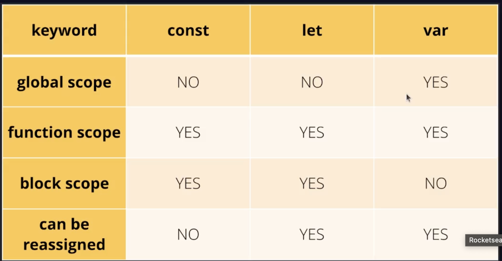

<h1 align="center">🚀 Hoisting no JavaScript</h1>

<p align="center">

</p>

<p align="center">
  
  
  
</p>

---

## 🚀 O que é Hoisting?

**Hoisting** significa **"içamento"** ou **"elevação"**.

No JavaScript, antes do código ser executado, o motor faz uma leitura prévia do arquivo e move **declarações** para o topo do escopo.

### 📌 Importante

- Apenas as **declarações sobem**;
- As **atribuições não sobem**;
- O comportamento muda entre `var`, `let`, `const` e `function`.

---

## 🧠 Como o JavaScript interpreta o código?

O JavaScript executa em duas fases:

### 1️⃣ Fase de Criação
- Cria o contexto de execução;
- Reserva espaço na memória;
- Aplica o hoisting.

### 2️⃣ Fase de Execução
- Executa o código linha por linha;
- Atribui valores;
- Executa funções.

O hoisting acontece na **fase de criação**.

---

# 📦 Hoisting com `var`

```js
console.log(nome);
var nome = "Lucas";
```

### 🔎 Como o JavaScript interpreta internamente:

```js
var nome;
console.log(nome);
nome = "Lucas";
```

### 🧾 Resultado:

```
undefined
```

---

# 📨 Hoisting com `let`

```js
console.log(idade);
let idade = 25;
```

### 🧾 Resultado:

```
ReferenceError: Cannot access 'idade' before initialization
```

📌 `let` sofre hoisting, mas fica na **Temporal Dead Zone (TDZ)** até ser inicializada.

---

# 🚀 Hoisting com `const`

```js
console.log(pais);
const pais = "Brasil";
```

### 🧾 Resultado:

```
ReferenceError: Cannot access 'pais' before initialization
```

📌 `const` também fica na **Temporal Dead Zone (TDZ)**.

---

# 🔄 Hoisting com Function Declaration

```js
saudacao();

function saudacao() {
  console.log("Olá!");
}
```

### 🧾 Resultado:

```
Olá!
```

📌 Funções declaradas sobem completamente (nome + corpo).

---

# ❌ Function Expression

```js
teste();

var teste = function() {
  console.log("Teste");
};
```

### 🔎 Internamente o JS interpreta assim:

```js
var teste;

teste();

teste = function() {
  console.log("Teste");
};
```

### 🧾 Resultado:

```
TypeError: teste is not a function
```

📌 O hoisting acontece apenas da variável, não da função atribuída.

---

# 🧩 Resumo Geral

| Tipo                  | Sofre Hoisting? | Pode usar antes? | Resultado |
|-----------------------|-----------------|------------------|------------|
| `var`                 | Sim             | Sim              | `undefined` |
| `let`                 | Sim             | Não              | ReferenceError |
| `const`               | Sim             | Não              | ReferenceError |
| Function Declaration  | Sim (completo)  | Sim              | Executa normalmente |
| Function Expression   | Parcial         | Não              | TypeError |

---

# 🎯 Conclusão

Hoisting não move o código fisicamente.

O que acontece é que o JavaScript **prepara a memória antes da execução**, registrando declarações no topo do escopo.

Entender hoisting é essencial para:
- Evitar erros inesperados;
- Escrever código mais previsível;
- Dominar o funcionamento interno do JavaScript.