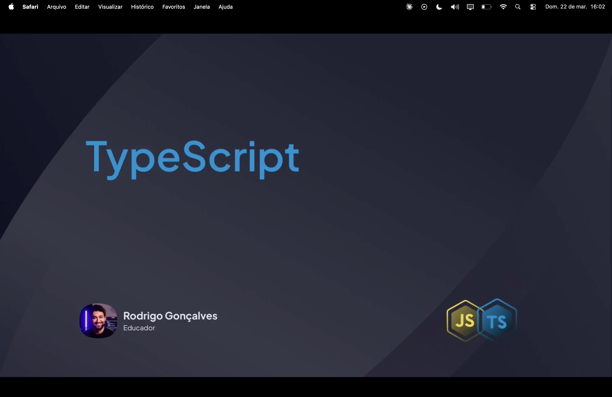
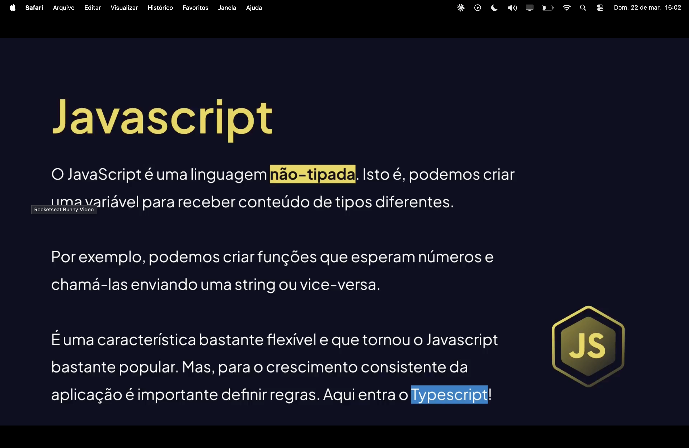
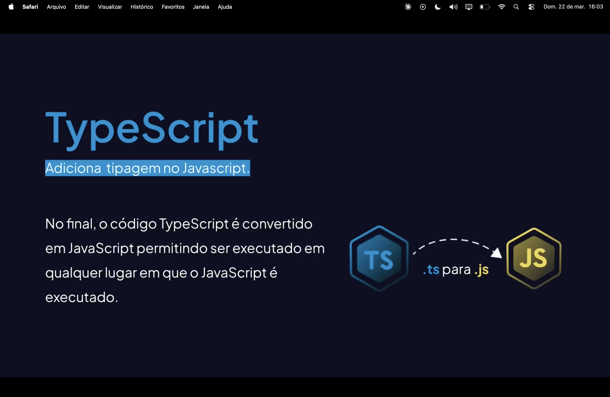
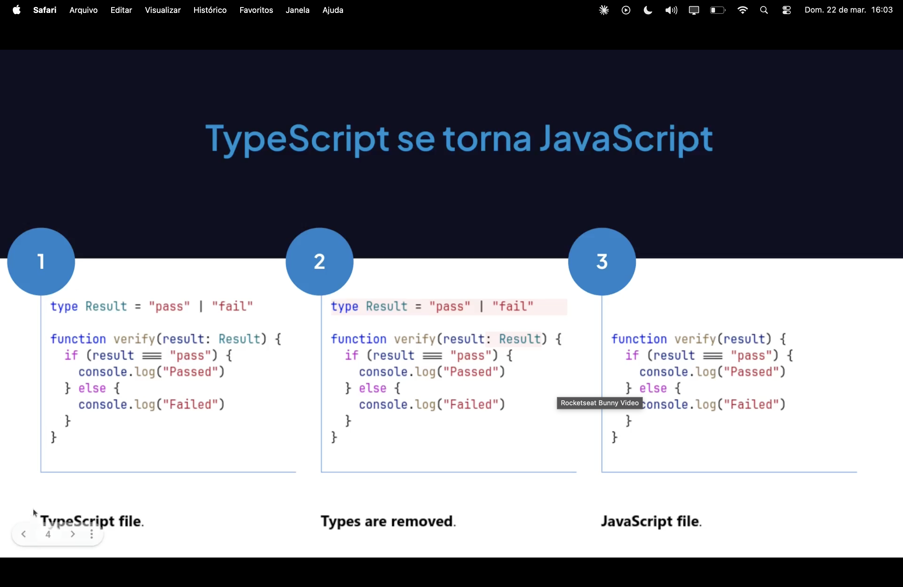
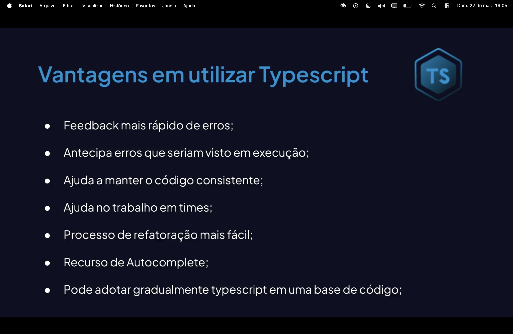

<h1 align="center">  338 - O que é TypeScript <br>
</h1>

<p align="center">


</p>

---

<h2 align="center">📖 O que é TypeScript? <br>
</h2>

O <mark style="background-color: #ADD8E6">**TypeScript**</mark> é um superconjunto (superset) de JavaScript criado pela Microsoft. Ele adiciona **tipagem estática opcional** e recursos modernos ao JavaScript puro (JS).

No desenvolvimento profissional, o TypeScript é essencial para:
- Detectar erros durante o desenvolvimento (antes de rodar o código);
- Facilitar a manutenção de projetos grandes;
- Fornecer um "autocompletar" (IntelliSense) muito mais inteligente;
- Melhorar a documentação do código através dos tipos.

---

<h2 align="center">⚙️ Como funciona a Compilação? <br>
</h2>

O TypeScript não é executado diretamente pelo navegador ou pelo Node.js. Ele precisa passar por um processo de **transpilação** (transformação de código fonte para código fonte).

Fluxo simplificado:

<pre>
Código TS (.ts) → Tipos e Interfaces
            ↓
    Compilador (TSC)
            ↓
Código JS (.js) → Pronto para o Navegador
            ↓
   Execução do Projeto
</pre>

---

<h2 align="center">📦 Diferenciais do TypeScript <br>
</h2>

Diferente do JS comum, o TS introduz conceitos que protegem o desenvolvedor:

- **Tipagem Estática:** Você define se algo é `string`, `number` ou um objeto específico;
- **Interfaces:** Contratos que definem a estrutura de objetos;
- **Enums:** Conjunto de constantes nomeadas;
- **Generics:** Componentes que aceitam tipos variados mantendo a segurança.

---

<h2 align="center">💻 Exemplo de Código <br>
</h2>

Comparação entre a liberdade (perigosa) do JS e a segurança do TS:

```typescript
// Em JavaScript comum:
// function soma(a, b) { return a + b; }
// soma("1", 2) retornaria "12" (bug silencioso)

// Em TypeScript:
const soma = (a: number, b: number): number => {
  return a + b;
};

console.log(soma(5, 10)); // ✅ Correto
// soma("5", 10); // ❌ Erro de compilação imediato!
```
<h2 align="lefr"> Benefícios vs Desvantagens</h2>

Benefícios:

- Redução drástica de bugs em produção;

- Refatoração de código muito mais segura;

- Integração nativa com VS Code e outras IDEs;

- Suporte a recursos de ES6+ antes de virarem padrão.

- Desvantagens/Considerações:

- Necessidade de configurar um ambiente de build (tsconfig);

- Curva de aprendizado inicial para entender interfaces e tipos;

- O código fica ligeiramente mais verboso.

<h2 align="left">📄 TypeScript vs JavaScript</h2>
JavaScript: É a linguagem base. Flexível, dinâmica, mas propensa a erros de tipo em tempo de execução.


TypeScript: É o JavaScript com "superpoderes" de tipagem. Ele garante que os dados que fluem pelo seu app sejam exatamente o que você espera.